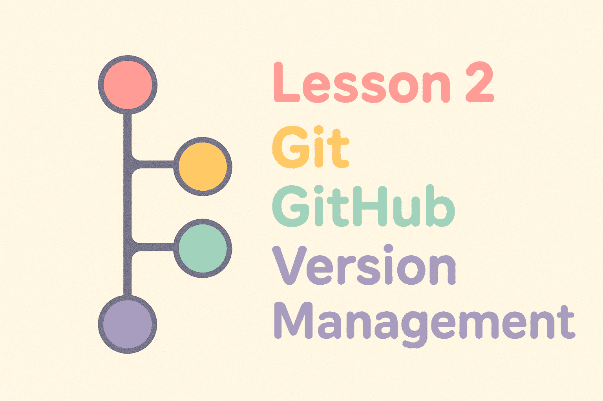

<<<<<<< HEAD
# Fall 2025 Zero to ML Workshops

_Image created with `gpt-image-1`_
=======
# Workshop 2: Version Control, Git, and GitHub

_Master the art of tracking changes and collaborating on code!_
>>>>>>> 4ae550926dac23f1f23a39bace3ba3be3e737324

## Overview
Welcome to Workshop 2! Today we're learning about **version control** - a system that tracks changes to your files over time. We'll focus on **Git**, the most popular version control tool, and **GitHub**, a platform where people share and collaborate on code projects.

By the end of this workshop, you'll understand why every developer uses these tools and know how to contribute to projects, collaborate with teammates, and never lose your work again! 🎯

## The Problems Version Control Solves

### Problem 1: The "Final Version" Nightmare
You've probably done this before:
```
my-essay.docx
my-essay-final.docx
my-essay-final-FINAL.docx
my-essay-final-FINAL-really-final.docx
my-essay-final-v2.docx
```

**What if you could:** Keep one file but see every version you've ever saved, compare changes between versions, and instantly go back to any previous version?

### Problem 2: Collaboration Chaos
Imagine you and 3 friends are writing a group project. You email files back and forth:
- Sarah sends "project-v1.docx" 
- Mike edits it and sends "project-v2-mike-changes.docx"
- Bob also edits Sarah's version and sends "project-v1-bob-edits.docx"
- Now you have conflicting versions and no idea how to merge them! 😱

**What if you could:** All work on the same project simultaneously, automatically merge changes, and see exactly who changed what and when?

### Problem 3: The "Oops I Broke Everything" Crisis
You're coding and everything works perfectly. You make "just a small change" and suddenly nothing works. You can't remember exactly what you changed, and you spend hours trying to fix it.

**What if you could:** Instantly undo any change, see exactly what you modified, and experiment freely knowing you can always go back?

**Git solves all these problems!** It's like having a time machine for your files plus a collaboration superpower.

## What is Git?

**Git** is a version control system that tracks changes to files in a folder (called a **repository** or **repo**). Think of it as a sophisticated "autosave system" that remembers every version of your project.

**GitHub** is a website that hosts Git repositories online, making it easy to share code and collaborate with others. It's like Google Drive for code, but much more powerful.

### Key Git Concepts

Before we dive into commands, let's understand the basic concepts:

- **Repository (repo)**: A folder that Git is tracking
- **Commit**: A saved snapshot of your project at a specific time (like hitting "save" in a game with a description)
- **Branch**: A parallel version of your project (like making a copy to experiment with)
- **Remote**: A copy of your repository stored online (usually on GitHub)
- **Clone**: Download a copy of someone else's repository
- **Push**: Send your changes to the online repository
- **Pull**: Download changes from the online repository

### Setting Up Git

If you don't have `git` already installed, run `sudo apt install git` on WSL/Ubuntu or `brew install git` on macOS.

Next, let's configure Git with your identity:

```bash
# Set your name (this will appear in your commits)
git config --global user.name "Your Name"

# Set your email (usually the same as your GitHub email)
git config --global user.email "your.email@example.com"

# Check your configuration
git config --list
```

### Your First Repository

Let's create your first Git repository step by step:

```bash
# Create a new project folder
mkdir my-first-repo
cd my-first-repo

# Initialize Git tracking in this folder
git init

# Check the status (Git's way of telling you what's happening)
git status
```

You'll see output saying "On branch main" and "No commits yet" - this means Git is ready but you haven't saved any snapshots yet.

### Exercise 1: Creating Your First Commit 📸

A **commit** is like taking a photograph of your project at a specific moment. Let's create our first commit:

1. **Create a file to track:**
   ```bash
   nano README.md
   ```
   
   In nano, type:
   ```markdown
   # My First Git Project
   
   This is my first project using Git!
   I'm learning version control.
   ```
   
   Save and exit (Ctrl+X, Y, Enter).

2. **See what Git thinks about your new file:**
   ```bash
   git status
   ```
   
   Git will show your file as "untracked" - it knows the file exists but isn't watching it yet.

3. **Tell Git to start tracking the file:**
   ```bash
   # Adds file to staging area (list of files git is watching)
   git add README.md
   # Check what changed
   git status
   ```
   
   Now it's "staged" - ready to be committed (saved as a snapshot).

4. **Create your first commit (snapshot):**
   ```bash
   git commit -m "Add initial README file"
   ```
   
   The `-m` flag lets you add a message describing what you changed.

5. **See your commit history:**
   ```bash
   git log
   ```

**Challenge:** Add another file, stage it, and commit it using the commands above. Practice reading the `git status` output to understand what's happening at each step.

### Summary: the Commit Workflow

Git has a three-stage workflow to commit changes:

1. **Working Directory**: Where you edit files normally
2. **Staging Area**: Where you prepare files for committing (like putting items in a shopping cart before checkout)
3. **Repository**: Where committed snapshots are stored (like your permanent purchase history)

```bash
# See what's changed since your last commit
git status

# See what's changed in individual files
git diff

# Stage specific files for committing
git add filename.py

# Stage all changed files
git add .

# Commit staged changes
git commit -m "Describe what you changed"

# See your commit history
git log --oneline  # Shorter, easier to read format
```

## Branching: Experimenting Safely

**Branches** let you experiment with changes without affecting your main code. Imagine you're writing an essay and want to try a completely different introduction without losing your original version. Git lets you create a 'copy' (**branch**) of your project to experiment with this new idea. 

When you're done tinkering, **git will automatically figure out the differences between your branch and the original project.** If there are no 'conflicts' (different content on the same line), it will also **merge** the two changes together automatically. Much faster than trying to scan two files manually to determine changes. 💪

```bash
# See what branch you're on (usually 'main')
git branch

# Create a new branch (like making a copy to experiment with)
git branch experiment

# Switch to your new branch
git checkout experiment

# Or create and switch in one command
git checkout -b feature-new-idea

# See all branches
git branch
```

### Exercise 2: Branching and Merging Adventure 🌿

Let's practice working with branches:

1. **Create an experimental branch:**
   ```bash
   git checkout -b add-contact-info
   git status  # Notice you're now on the new branch
   ```

2. **Make changes on this branch:**
   ```bash
   nano README.md
   ```
   
   Add to your README.md:
   ```markdown
   ## Contact
   Email: my.email@example.com
   GitHub: myusername
   ```
   
   Save and exit.

3. **Commit your changes:**
   ```bash
   git add README.md
   git commit -m "Add contact information"
   ```

4. **Switch back to main branch:**
   ```bash
   git checkout main
   cat README.md  # Notice the contact info isn't here!
   ```

5. **Merge your experimental branch:**
   ```bash
   git merge add-contact-info
   cat README.md  # Now the contact info is here!
   ```

6. **Clean up the branch (optional):**
   ```bash
   git branch -d add-contact-info  # Delete the branch since we merged it
   ```

**Challenge:** Create another branch, make some changes, but DON'T merge it. Switch between branches and see how your files change!

## Working with Remote Repositories (GitHub)

So far, everything has been local (on your computer). But the real power comes from working with **remote repositories** - copies of your project stored online that you can share with others.

The most common remote repository hosting service is **GitHub**. It's like Google Drive, but for code.

### Creating a GitHub Repository

1. Go to [GitHub.com](https://github.com) and create an account (if you don't have one)
2. Click the green "New" button to create a new repository
3. Give it a name like "my-first-git-project"
4. Keep it public and don't initialize with README (we already have one)
5. Click "Create repository"

### Connecting Your Local Repository to GitHub

GitHub will show you commands to connect your local repo. They'll look like this:

```bash
# Add GitHub as a remote location (like adding a contact to your phone)
git remote add origin https://github.com/yourusername/my-first-git-project.git

# Push your code to GitHub (upload your commits)
git push -u origin main

# The -u flag sets up tracking so future pushes can just be 'git push'
```

## Understanding Pull Requests

A **Pull Request (PR)** is GitHub's way of saying "Hey, I made some changes to this project. Would you like to include them?" It's like proposing an edit to a shared document.

### When to Use Pull Requests:
- Contributing to open-source projects
- Working on team projects
- Getting code reviewed before it goes live
- Discussing changes before they're final

### The Pull Request Process:
1. Fork or clone a repository
2. Create a new branch for your changes
3. Make and commit your changes
4. Push your branch to GitHub
5. Create a Pull Request
6. Discuss and review the changes
7. Merge the changes into the main project

### Exercise 3: Your First GitHub Contribution 🚀


Let's practice the complete workflow of making changes and sharing them by adding a joke to the `jokes` branch of this repository. **When you are not a collaborator with preapproved access to a public repository (like this one), you will need to fork the repository first.**. Then, you can make changes on your own copy of the repository before trying to create a Pull Request.

1. **Fork the repository on GitHub:**
   - Go to the repository page on GitHub: https://github.com/WAT-ai/F25-Zero-to-ML-Workshops
   - Click the "Fork" button (top right) to create your own copy of the repository under your account.

2. **Clone your forked repository to your computer:**
   ```bash
   git clone https://github.com/yourusername/F25-Zero-to-ML-Workshops.git
   cd F25-Zero-to-ML-Workshops
   git remote -v  # Should show 'origin' pointing to your fork
   git remote add upstream https://github.com/WAT-ai/F25-Zero-to-ML-Workshops.git  # Add the original repo under the name 'upstream' (instead of our usual name 'origin')
   git pull upstream workshop-2  # Get the latest changes from the original repo
   ```

3. **Create a new feature branch:**
   ```bash
   git checkout -b feat/jokes-[firstname]-[lastinitial]
   ```

4. **Add new content:**
   ```bash
   nano [firstname]-[lastinitial].txt
   ```

   Then, add a joke. Save it with `CTRL + S`, then `Enter`, and exit with `CTRL + X`.

5. **Stage and commit your changes:**
   ```bash
   git add .
   git commit -m "Add joke about ..."
   ```

6. **Push your branch to your fork on GitHub:**
   ```bash
   git push origin feat/jokes-[firstname]-[lastinitial]
   ```

7. **Create a Pull Request from your fork:**
   - Go to your forked repository on GitHub
   - GitHub will show a yellow banner suggesting you create a Pull Request
   - Click "Compare & pull request"
   - Make sure the base repository is `WAT-ai/F25-Zero-to-ML-Workshops` and the base branch is `jokes`
   - Add a description of your changes
   - Click "Create pull request"

8. **Wait for your Pull Request to be reviewed and merged:**
   - In real projects, someone else will review and merge your PR
   - After merging, you can delete your feature branch on GitHub

9. **Update your local repository after your PR is merged:**
   ```bash
   git checkout workshop-2  # Or main, as appropriate
   git pull upstream workshop-2  # Get the latest changes from the original repo
   git branch -d feat/jokes-[firstname]-[lastinitial]  # Delete your local branch
   ```

**Congratulations!** You just completed your first GitHub workflow using a fork and Pull Request! This is how anyone can contribute to open-source projects, even without collaborator access.

## Common Git Workflows and Commands

### The Daily Development Workflow
```bash
# Start your day - get the latest changes
git pull origin main

# Create a new feature branch
git checkout -b feat/feature-name

# Make changes, then stage and commit them
git add .
git commit -m "Descriptive message about what you changed"

# Push your branch to share with others
git push origin feat/feature-name

# When ready, create a Pull Request on GitHub
# After it's merged, clean up locally:
git checkout main
git pull origin main
git branch -d feat/feature-name
```

### Useful Commands for Daily Work
```bash
# See what's changed since last commit
git status
git diff

# See commit history
git log --oneline
git log --graph  # Visual representation of branches

# Undo changes to a file (before committing)
git checkout -- filename.py

# Go back to a previous commit (careful!)
git reset --hard commit-hash

# See all branches (local and remote)
git branch -a

# Download a repository from GitHub
git clone https://github.com/username/repository-name.git
```

## Common Git Scenarios and Issues

**"I accidentally committed something I shouldn't have"**
```bash
# Undo the last commit but keep the changes
git reset --soft HEAD~1

# Or completely remove the last commit and changes (careful!)
git reset --hard HEAD~1
```

### Git Best Practices

**Writing Good Commit Messages:**
- **Bad**: "Fixed stuff"
- **Good**: "Fix login button not responding on mobile devices"
- **Pattern**: Start with a verb, be specific, keep under 50 characters

**Branching Strategy:**
- Keep `main` branch stable and working
- Keep a `dev` branch for experimental changes
- Create feature branches for each new feature or bug fix. Use descriptive branch names like `feat/fix-login-bug` or `feat/add-user-profile`. Merge these into the `dev` branch. 
- When there are enough new functionalities in the `dev` branch, merge it into the `main` branch.

**Before You Commit:**
```bash
# Always check what you're about to commit
git status
git diff

# Only commit related changes together
git add specific-file.py  # Instead of git add .
```

### Troubleshooting Common Issues

**"I made a mistake in my last commit message"**
```bash
git commit --amend -m "Better commit message"
```

**"I want to see what changed between two commits"**
```bash
git diff commit1..commit2
```

**"I want to work on someone else's project"**
```bash
# Fork their repository on GitHub, then:
git clone https://github.com/yourusername/their-project-name.git
cd their-project-name
git checkout -b my-feature
# Make changes, commit, push, create PR
```

**"I'm on the wrong branch!"**
```bash
git checkout main  # Switch to main
git checkout -b correct-branch  # Create the right branch
```

**"My repository is out of sync with GitHub"**
```bash
git pull origin main  # Download latest changes
# If there are conflicts, Git will tell you which files need fixing
```

**"I don't know what branch I'm on"**
```bash
git branch  # Shows all local branches, current one marked with *
git status  # Also shows current branch
```

**"I can't push to this repository"**
- You might not have permission (need to be a collaborator)
- You might need to fork the repository first
- Your branch might be out of date (try `git pull` first)

## What's Next?

Congratulations! You now understand the fundamentals of version control and can collaborate on projects like a professional developer. These skills are essential for everything we'll do in future workshops.

All the commands you've learned today - `git add`, `git commit`, `git push`, `git branch` - are part of Git's underlying superpower: **tracking every single change you make, line by line, file by file, over time**. Git creates a detailed history of your project that lets you see exactly what changed, when it changed, and who changed it. There's a lot more depth you can explore if you want - Git can show you the evolution of individual lines of code, help you find which commit introduced a bug, automatically merge complex changes, and much more. For now though, you've got the essentials!

In our next workshop, we'll dive into **Object-Oriented Programming with Python**, where you'll learn how to:
- Organize code into classes and objects
- Write reusable and maintainable code
- Apply programming principles used in real software development
- Build the foundation for understanding machine learning libraries

### Homework (Optional but Recommended):
1. Create a personal `notes` repository and practice the commit workflow by adding notes to it in your courses
2. Find an interesting open-source project on GitHub and explore its commit history
3. Practice creating branches for any changes you make
4. Try forking a simple project and making a small contribution

### Resources for Further Learning:
- [Git Handbook](https://guides.github.com/introduction/git-handbook/)
- [Interactive Git Tutorial](https://learngitbranching.js.org/)
- [GitHub's Git Cheat Sheet](https://education.github.com/git-cheat-sheet-education.pdf)
- [Understanding Git Conceptually](https://www.atlassian.com/git/tutorials/what-is-version-control)

Remember: **Git might feel complex at first, but every developer uses it daily!** The concepts become natural with practice. You're building skills that will serve you throughout your entire programming career! 💪

---

*See you at Workshop 3: Object-Oriented Programming with Python!* 🚀

To switch to the third workshop, run:
```bash
git checkout workshop-3
```
**Note: take a look at `SetupVSCode.md` in the `workshop-3` branch for instructions to install VSCode before the next workshop**

To go back to the main page, run:
```bash
git checkout main
```