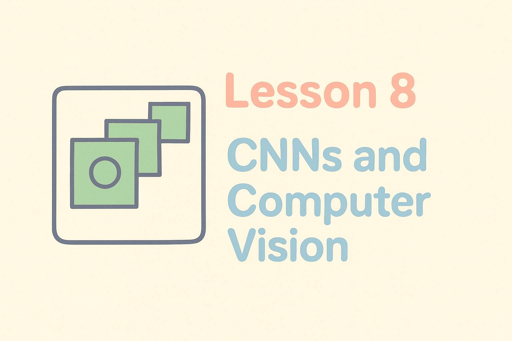

# Workshop 8: CNNs and Computer Vision



_Build and train convolutional neural networks with PyTorch!_

(Note: you should have completed Workshop 7 or be familiar with PyTorch basics and neural networks)

## Overview

Convolutional Neural Networks (CNNs) are the backbone of modern computer vision. In this workshop, you'll build intuition for how images are represented as tensors, how convolutional filters detect features, and how to train a CNN to classify images. You'll also get a taste of transfer learning — using a pretrained model to skip most of the training work.

### What You'll Learn

- **Images as Numbers**: How images are stored as 3D tensors (channels × height × width)
- **Convolution**: How filters slide over images to detect edges, textures, and shapes
- **Building a CNN**: Stacking Conv2d, ReLU, MaxPool2d, and Linear layers in PyTorch
- **Training**: Mini-batch loading with DataLoader and gradient updates with Adam/SGD
- **Data Augmentation**: Generating varied training examples with random flips, rotations, and shifts
- **Transfer Learning**: Fine-tuning a pretrained ResNet-18 for a new task

### Workshop Structure

The workshop is structured as a 6-level progression in `computer-vision.ipynb`:

1. **Level 1 — Images Are Just Numbers**: Explore the FashionMNIST dataset; understand image shape and pixel values
2. **Level 2 — Filters Detect Features**: Implement convolution by hand using Sobel and blur kernels
3. **Level 3 — Build a CNN**: Construct a two-block CNN using `nn.Sequential`
4. **Level 4 — Train It**: Use `DataLoader` and `torch.optim` to train on 60,000 images
5. **Level 5 — Make the Data Work Harder**: Apply data augmentation with `torchvision.transforms`
6. **Level 6 — And Beyond**: Load a pretrained ResNet-18 and fine-tune only the final layer

## Setup Instructions

### Step 1: Create Virtual Environment
```bash
python -m venv env

# Activate the environment
source env/bin/activate  # On Windows: env\Scripts\activate
```

### Step 2: Install Dependencies
```bash
pip install numpy matplotlib jupyter torch torchvision
```


## Troubleshooting

### Package Installation Issues
**Installation fails**
- Ensure the virtual environment is activated
- Try upgrading pip: `pip install --upgrade pip`
- On some systems: `pip install torch --no-cache-dir`

**Import errors**
- Verify you're using the correct kernel in Jupyter
- Restart the kernel if you just installed packages
- Check installation: `python -c "import torch; print(torch.__version__)"`

### Training Issues
**Loss not decreasing**
- Try a smaller learning rate (e.g. `lr=1e-4` instead of `1e-3`)
- Make sure you're calling `opt.zero_grad()` before each backward pass
- Ensure `model.train()` is called during training

**Out of memory**
- Reduce `batch_size` in the DataLoader (e.g. 32 instead of 64)

### Next Steps
After this workshop, you'll be ready to:
- Explore larger datasets and colour images (e.g. CIFAR-10)
- Try more advanced architectures (ResNets, EfficientNet)
- Apply CNNs to object detection and segmentation tasks

## When You're Done

```bash
# Deactivate your virtual environment
deactivate

# Return to main branch or continue to next workshop
git checkout main
```
