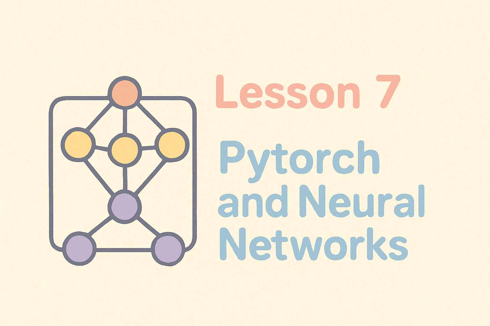

# Workshop 7: PyTorch and Neural Networks



_Build and train neural networks with PyTorch!_

(Note: you should have completed Workshop 6 or be familiar with NumPy and basic ML concepts)

## Overview

PyTorch is one of the most popular deep learning frameworks, known for its flexibility and intuitive design. In this workshop, you'll learn PyTorch fundamentals and apply them to build and train neural networks from scratch. You'll understand how classical machine learning transitions to neural networks and implement your first deep learning models.

### What You'll Learn

- **PyTorch Basics**: Tensors, autograd, and computational graphs
- **Neural Network Fundamentals**: Layers, activation functions, and forward propagation
- **Training Process**: Loss functions, optimizers, and backpropagation
- **Model Building**: Create neural networks using PyTorch's nn.Module
- **From Classical ML to NNs**: Understand how traditional ML methods evolve into neural networks

### Workshop Structure

1. **PDF**: Classical ML to Neural Networks concepts
   - Transition from linear models to neural networks
   - Understanding layers, activation functions, and learning
2. **Notebook**: PyTorch implementation and neural network training
   - PyTorch tensor operations
   - Building and training neural networks
   - Hands-on examples with real datasets

## Setup Instructions

### Step 1: Create Virtual Environment
```bash
# Create a virtual environment for NumPy workshop
python -m venv numpy-env

# Activate the environment
source numpy-env/bin/activate  # On Windows: numpy-env\Scripts\activate
```

### Step 2: Install Dependencies
```bash
# Install dependencies (torch takes up a LOT of space)
pip install numpy pandas matplotlib jupyter torch torchvision
```
If you don't want to install all that locally, use the [Kaggle Notebook](https://www.kaggle.com/code/madhavmalhotra/intro-to-pytorch?scriptVersionId=274013702). Otherwise, open the `torch-basics.ipynb` notebook.

## Troubleshooting

### Package Installation Issues
**Installation fails**
- Ensure virtual environment is activated
- Try upgrading pip: `pip install --upgrade pip`
- On some systems, you may need: `pip install torch --no-cache-dir`

**Import errors**
- Verify you're using the correct kernel in Jupyter
- Restart the kernel if you just installed packages
- Check installation: `python -c "import torch; print(torch.__version__)"`

### Algorithm Issues
**Gradient descent not converging**
- Check your learning rate (try smaller values like 0.001, 0.0001)
- Verify loss is decreasing over iterations
- Ensure features are properly normalized

### Next Steps
After this workshop, you'll be ready to:
- Explore scikit-learn for more ML algorithms
- Learn about more advanced algorithms like CNNs and RNNs

## When You're Done

After completing the NumPy workshop:

```bash
# Deactivate your virtual environment
deactivate

# Return to main branch or continue to next workshop
git checkout main
```