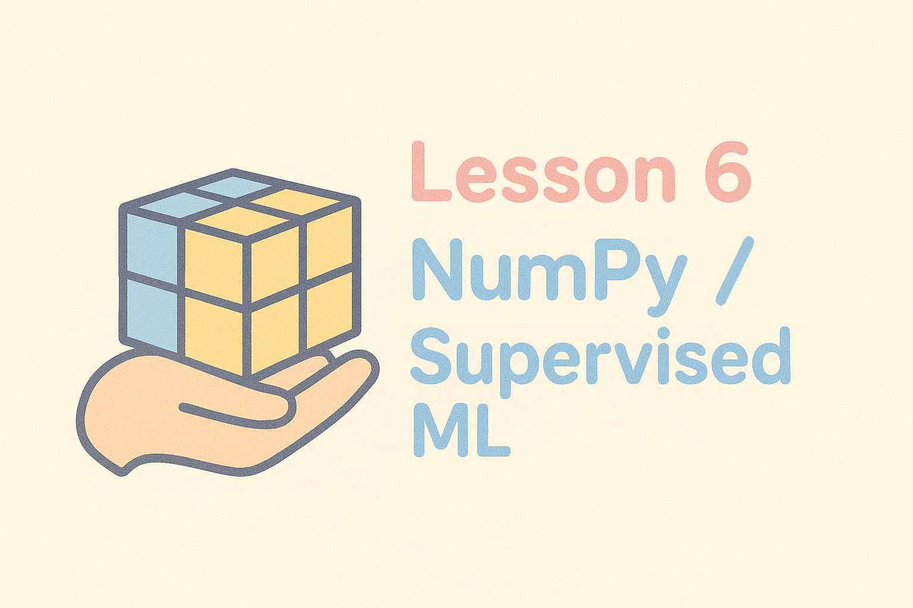

# Workshop 6: NumPy and Machine Learning Fundamentals
_Master numerical computing and build ML algorithms from scratch!_



(Note: you should have completed Workshops 1-3 and be familiar with Python basics and virtual environments)

## Overview

NumPy is the foundation of rapid computing in Python. It provides powerful array operations and mathematical functions that make computations as efficient as C code. In this workshop, you'll learn NumPy fundamentals and apply them to implement machine learning algorithms from scratch.

### What You'll Learn

- **NumPy Basics**: Arrays, indexing, slicing, and broadcasting
- **Array Operations**: Mathematical operations, aggregations, and transformations
- **ML Concepts**: Loss functions, prediction equations, and optimization algorithms
- **Algorithm Implementation**: Build genetic optimization and gradient descent from scratch
- **Performance Comparison**: Compare different optimization approaches on real data

### Workshop Structure

1. **Notebook 1**: NumPy fundamentals and essential operations
2. **PDF**: ML concepts (loss functions, gradient descent, genetic algorithms)
3. **Notebook 2**: Implement and compare optimization algorithms
   - Genetic algorithm vs. gradient descent
   - Simple linear regression on Kaggle dataset
   - Mean Squared Error (MSE) as loss/fitness function

## Setup Instructions

### Step 1: Create Virtual Environment
```bash
# Create a virtual environment for NumPy workshop
python -m venv numpy-env

# Activate the environment
source numpy-env/bin/activate  # On Windows: numpy-env\Scripts\activate
```

### Step 2: Install Dependencies
```bash
# Install NumPy, Jupyter, and other dependencies
pip install -r requirements.txt
```

### Step 4: Open the NumPy Notebooks
1. Open VS Code in your project folder: `code .`
2. Ensure Jupyter extension is installed
3. Start with `numpy-basics.ipynb` (Notebook 1)
4. Select your `numpy-env` kernel
5. After, proceed to `numpy-optimization.ipynb` (Notebook 2)

## Troubleshooting

### Package Installation Issues
**NumPy installation fails**
- Ensure virtual environment is activated
- Try upgrading pip: `pip install --upgrade pip`
- On some systems, you may need: `pip install numpy --no-cache-dir`

**Import errors**
- Verify you're using the correct kernel in Jupyter
- Restart the kernel if you just installed packages
- Check installation: `python -c "import numpy; print(numpy.__version__)"`

### Performance Issues
**Code runs slowly**
- NumPy operations should be fast; avoid Python loops when possible
- Use vectorized operations instead of iterating over arrays
- For large datasets, consider working with smaller samples first

**Memory errors**
- Large arrays can consume significant memory
- Try reducing dataset size for testing
- Use `dtype` parameter to reduce memory (e.g., `float32` instead of `float64`)

### Algorithm Issues
**Gradient descent not converging**
- Check your learning rate (try smaller values like 0.001, 0.0001)
- Verify loss is decreasing over iterations
- Ensure features are properly normalized

**Genetic algorithm stuck**
- Increase population size
- Adjust mutation rate
- Check fitness function is calculating correctly

### Next Steps
After this workshop, you'll be ready to:
- Explore scikit-learn for more ML algorithms
- Learn TensorFlow or PyTorch for deep learning

## When You're Done

After completing the NumPy workshop:

```bash
# Deactivate your virtual environment
deactivate

# Return to main branch or continue to next workshop
git checkout main
```