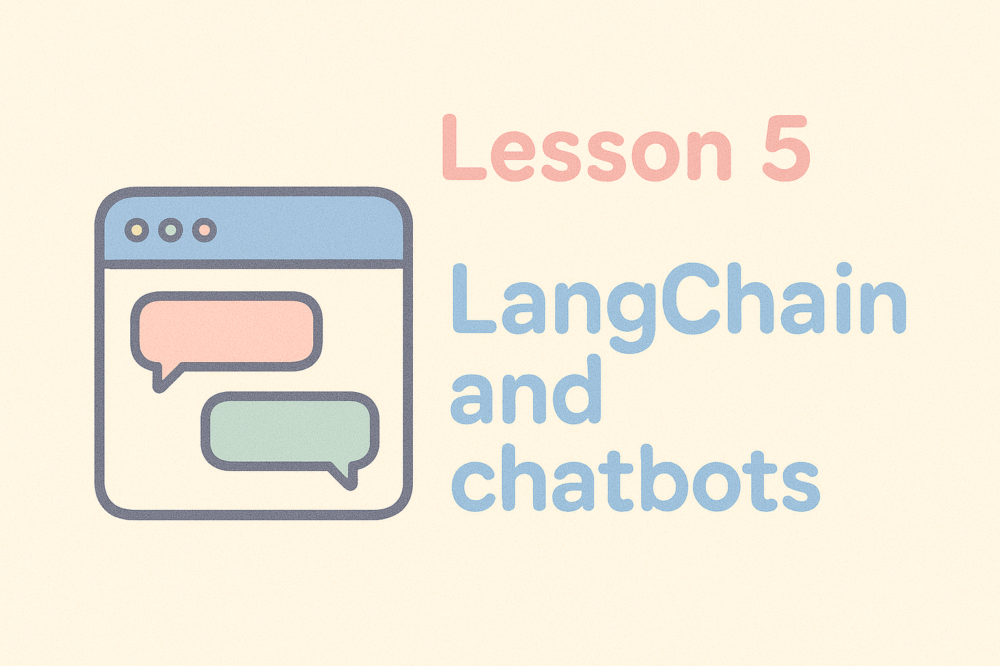

# Workshop 5: LangChain and AI Applications

_Build intelligent applications with Large Language Models!_

(Note: you should have completed Workshops 3-4 and be familiar with Python, pandas, and virtual environments)

## Overview

LangChain is a framework that makes it easier to tools to work with language models like GPT, Claude, or open-source alternatives. Think of it as glue that connects together large language models, data sources, your own APIs, and more. With LangChain, you can:

- **Chain together AI operations**: Connect multiple AI tasks in sequence
- **Work with data**: Load, split, and search through text (or other) documents
- **Manage past interactions**: Give AI applications the ability to remember conversation history
- **Manage integrations**: Connect AI to databases, APIs, and other tools
- **Customise prompts**: Optimize how you ask questions to AI models

## API Setup

**Important**: This workshop requires an API key from an AI service. For this workshop, we'll provide instructions for OpenAI, though some other options are listed below if you want to experiment yourself:

### Option 1: OpenAI (Recommended for beginners)
- Create account at [platform.openai.com](https://platform.openai.com)
- Navigate to API keys section
- Create a new API key
- **Cost**: ~$1-5 for workshop exercises (pay-per-use)

### Option 2: Claude
- Create account at [claude.ai](https://claude.ai)
- Navigate to API keys section
- Create a new API key
- **Cost**: $0.50-4 for workshop exercises (pay-per-use)

### Option 3: Hugging Face
- Create account at [huggingface.co](https://huggingface.co)
- Get an API key from your settings
- **Cost**: Free tier available, but limited usage

**Note**: We'll show you how to set up your API key securely using environment variables.

## Setup Instructions

### Step 1: Create Virtual Environment
```bash
# Create a virtual environment for LangChain
python -m venv langchain-env

# Activate the environment
source langchain-env/bin/activate
```

### Step 2: Install Dependencies
```bash
# Install from requirements.txt (includes LangChain, OpenAI, and other dependencies)
pip install -r requirements.txt
```

### Step 3: Set Up API Key
**Never put API keys directly in your code!** Anyone can see/use them when you commit your code to Github. We'll instead use environment variables, which are local copies of the API keys that your code can read only when it needs. This avoids accidentally sharing your keys online.

Create a file named `.env` in your project folder:
```
OPENAI_API_KEY=<your-api-key-here>
# Optional: for Hugging Face
HUGGINGFACE_API_KEY=<your-huggingface-api-key-here>
```

The notebook will show you how to load these securely.

### Step 4: Open the LangChain Notebook
1. Open VS Code in your project folder: `code .`
2. Ensure Jupyter extension is installed
3. Open `langchain-1.ipynb`
4. Select your `langchain-env` kernel

## Troubleshooting

### API Key Issues
**"Invalid API key" or authentication errors**
- Verify your API key is correct and active
- Check that environment variable is set: `echo $OPENAI_API_KEY`
- Ensure you have credit/usage remaining on your account
- Try restarting your terminal and VS Code

**API key security concerns**
- Never commit API keys to Git repositories
- Use environment variables or .env files
- Add `.env` to your `.gitignore` file
- Rotate keys regularly in production applications

### Package Installation Issues
**LangChain installation fails**
- Ensure virtual environment is activated
- Try upgrading pip: `pip install --upgrade pip`
- Install individually if needed: `pip install langchain langchain-openai langchain-huggingface streamlit faiss-cpu`

**Version conflicts**
- LangChain ecosystem updates frequently
- If you encounter issues, try: `pip install --upgrade langchain langchain-openai langchain-huggingface streamlit faiss-cpu`

### Model Connection Issues
**Rate limiting or quota errors**
- Most APIs have usage limits for free/trial accounts
- Check your account usage and billing settings
- Consider using smaller models for testing
- Implement retry logic with delays

**Slow responses**
- AI model calls can take 1-30 seconds depending on complexity
- This is normal - be patient during API calls
- Consider using streaming responses for better user experience

## When You're Done

After completing the LangChain workshop:

```bash
# Deactivate your virtual environment
deactivate

# Return to main branch or continue to next workshop
git checkout main
```