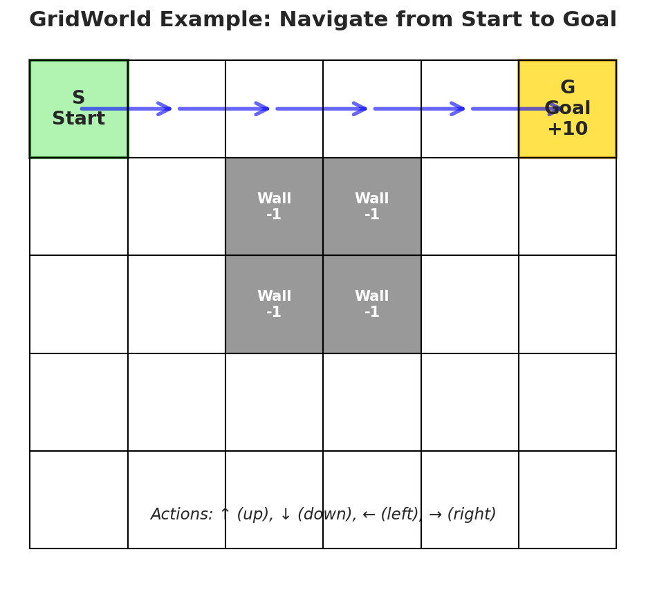
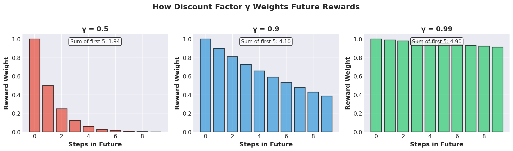
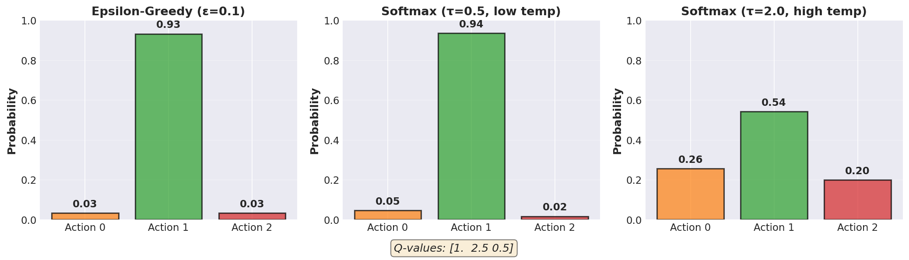
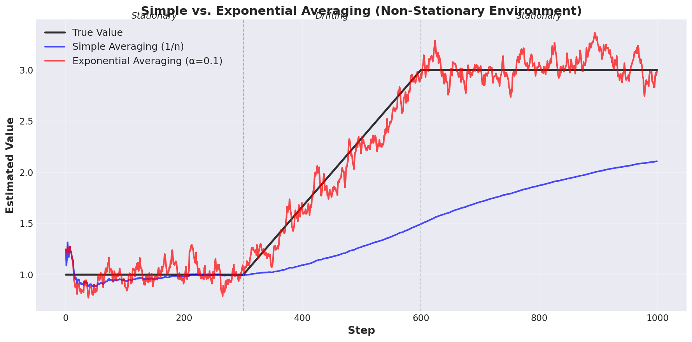
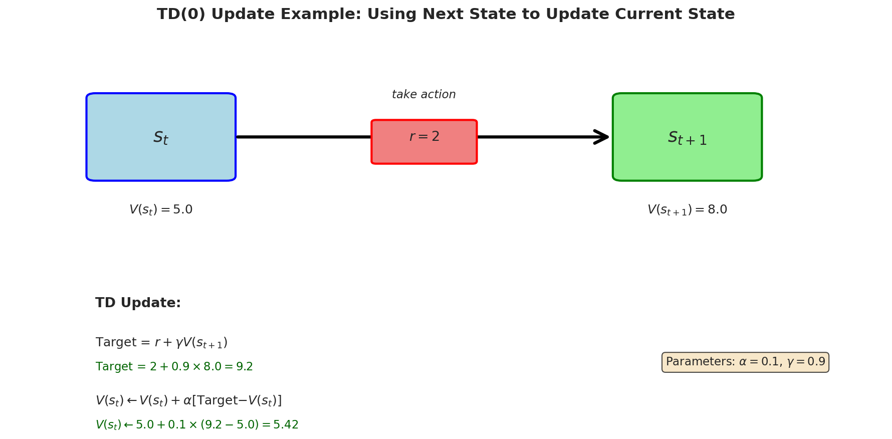
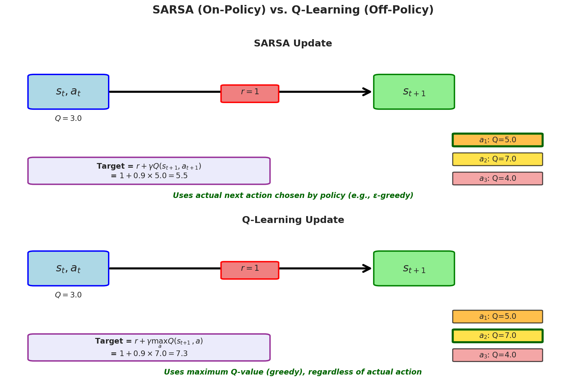
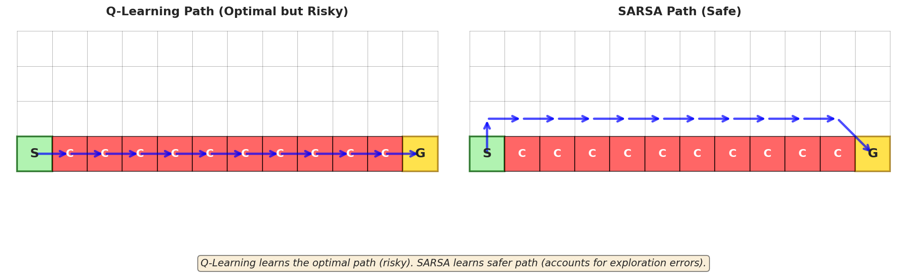
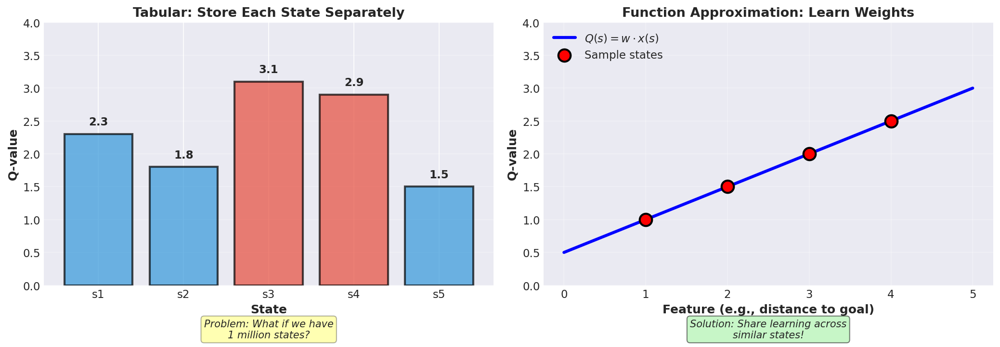
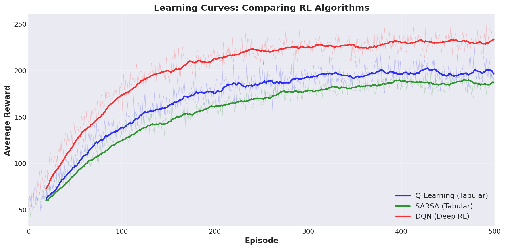

# Reinforcement Learning: A Minimal Math Intro


## What is Reinforcement Learning?

Reinforcement learning (RL) is one of the main types of machine learning. It's very different from most AI algorithms you might have heard of. 
- **Most common AI algorithms today are based on supervised learning**, where you give the algorithms examples of good answers and the algorithms learn to mimic those ansewrs. 
- In contrast, **RL is about learning from trial and error without being given the right answers**. Ex: Supervised ML is how you prep for your exam by doing practice problems and checking if your answer is the same as the given solution. RL is like how you learned to walk as a baby by trying things out, falling down, and trying again. 

Some key vocab for RL: 
1. There's some **environment** that the RL algorithm (AKA **agent**) interacts with. Ex: A self-driving car on the road, an AI controlling a ghost in the game pacman, etc.
2. The agent 'measures' what's happening in the environment (ex: the car's speed, acceleration, position). These measurements make up the **state** of the environment.
3. The agent chooses an **action** to take given the current observed state. Ex: The car can accelerate, brake, turn left, turn right.
4. Now the state has changed given the action and the agent is given some **reward** that we (the programmer) set. Ex: The agent gets +1 reward for staying in the lane, -1 reward for crashing. We create RL algorithms to maximise the reward they receive over time. 
5. The agent repeats the process (state -> action -> reward -> state -> ...)

**Goal of all RL algorithms:** learn which actions to take in each state to get the most total reward over time.


**Example - navigating a 'gridworld' game:**
- States: Your position on a grid (e.g., row 2, column 3)
- Actions: Move up, down, left, or right
- Rewards: +1 for reaching the goal, -1 for hitting a wall, 0 otherwise
- Learning challenge: Figure out the best path from any starting position to the goal



**The Challenge:** the agent doesn't know ahead of time where the walls or the goals are! It's just initialised at the starting square every time and left to try things out until it finds the best path.

Now that we have some basic RL jargon down, let's explore HOW an RL algorithm can figure out how to select actions to take in any state.

---

## 1. Value Functions and Policies

### The Big Picture

For the RL algorithm to select 'good' actions, it needs to (numerically) estimate one of two things:

1. **State-value $V(s)$**: How good is it to be in state $s$? Ex: A self-driving car might estimate the state value of having a state with speed over 150kmh on a highway is 0 (dangerous!). In contrast, the state with a speed of 100kmh on a highway might have estimated state-value 10 (safe)
2. **Action-value $Q(s, a)$**: How good is it to take a specific action $a$ in a state $s$? Ex: In the same self-driving car example, the action-value of accelerating when already at 150kmh might be -10 (very bad!), while the action-value of braking when at 150kmh might be +5 (good!)

Why are these useful? If the agent knows how 'good' each state is (state-value), it can choose actions that lead to better states. If the agent knows how 'good' each action is in each state (action-value), it can directly pick the best action to take.

Speaking of picking actions, the **policy $\pi(a|s)$** is the probability of picking action $a$ when in state $s$. The policy tells the agent what to do in each state. The **policy is derived from the action/state values**. We'll show how this happens soon.

**Two types of policies:**
- A deterministic policy always picks the same action in a given state
- A stochastic policy can pick different actions for the same state. Ex: In pacman, go left from the centre of the screen 70% of the time, go right 30% of the time.

### Key Math Equations

The complicated part is figuring out expressions for the state-value and action-value functions. Before diving into that complexity, let's just define a simple policy for now. 

Let's say we've _somehow_ found action-value estimates $Q(s,a)$ for all states $s$ and all actions $a$. Given these estimates, we can define a simple **greedy policy that always picks the action with the highest action-value** in each state:
$$\pi(a|s) = 1 \quad \text{if } a=\arg\max_{a'} Q(s, a')$$
$$\pi(a|s) = 0 \quad \text{otherwise}$$

Math notation breakdown:
- $\arg\max_{a'} f(a)$ is read as "the argument $a'$ that maximises our chosen function $f(a)$". 'Argument' is just the input to a function.
- $\arg\max_{a'} Q(s, a')$ means "whichever action $a'$ gives the biggest action-value $Q(s,a')$"
- So the greedy policy picks an action $a$ with 100% probability if it's the action that maximises $Q(s,a)$, and 0% probability otherwise. This makes sense because we want to pick the 'most good' action.

Now that we have a simple policy, how do we estimate the action-value $Q(s,a)$ which is needed for the policy to work? Recall that the agent receives a reward after selecting each action. The **rewards are the key to learning good estimates for the action/state values**. 

Consider an RL agent in some environment. At time step $t$, the agent is in state $s_t$, takes action $a_t$, receives reward $r_t$, and transitions to the next state $s_{t+1}$. This process continues and is often called an 'episode' or **'trajectory'** $\tau$: $$\tau = s_0, a_0, r_0, s_1, a_1, r_1, s_2, a_2, r_2, ...$$

We can define what we call a **return** $G_t$, which is the total reward received from time step $t$ onward:
$$G_t = \sum_{k=0}^{\infty} r_{t+k}$$
More commonly, we use a **discounted return** where we multiply future rewards by a discount factor $\gamma$ (between 0 and 1) to make them worth less than immediate rewards:
$$G_t = \sum_{k=0}^{\infty} \gamma^k r_{t+k}$$



Using this return, we can define the action-value function in 'general' (theoretically). It's the expected return after taking action $a$ in state $s$:
$$Q(s,a) = \mathbb{E}[G_t | s_t = s, a_t = a]$$

Math notation breakdown:
- $\mathbb{E}[G_{t}]$ means "the expected value of $G_t$" - basically the average value of $G_t$ if we knew all the possible values it could take on and how likely each value is. 
- Literally, the computation is defined as the possible values multiplied by their probabilities: $\mathbb{E}[G_{t}] = \sum_{\text{all possible values } g} g \cdot P(G_t = g)$
- The vertical bar "|" means "given that" - so we're looking at the expected return $G_t$ given that at time $t$ we were in state $s$ and took action $a$.

Intuition: it makes sense to define action-values as expected returns because we want to choose actions that lead to high total rewards over time. If one action has a higher expected return, that means the action is more likely to lead to better rewards in the long run - so we naturally assign it a high action-value since it's 'good' to choose that action.

We earlier stated that the above formula was 'general' (theoretical). A more concrete example (that still falls under the general equation) is to define the action-value $Q(s,a)$ as the average reward received after taking action $a$ in state $s$. Formally, we can write this as:
$$Q(s,a) = \frac{\text{total reward when taking action a in state s}}{\text{total number of times action a was taken in state s}} $$
$$Q(s,a) = \frac{\sum_{t} r_{t} \cdot \mathbf{1}(s_t = s, a_t = a)}{\sum_{t} \mathbf{1}(s_t = s, a_t = a)} $$

Math notation breakdown:
- $\mathbf{1}(condition)$ is an indicator function that equals 1 if the condition is true, and 0 otherwise.
- The numerator sums up all rewards $r_t$ received at time steps $t$ where the agent was in state $s$ and took action $a$. Otherwise, the indicator function is 0, so those rewards (for other states) don't count.
- The denominator counts how many times the agent took action $a$ in state $s$ (just adds 1 to the count every time that happens).

This is called the **sample-average method** of estimating action-values. It works if we're willing to sit around and try every action in every state many times to get good averages. Though you can tell **this is slow**. Note that this is one special case of the general expected return definition above among others.

Finally, you might be wondering why we've talked only about action values, not state values. The answer is that we can always derive state values from action values using the policy:
$$V(s) = \sum_{a} \pi(a|s) Q(s,a)$$
Or in more general terms using expectation notation:
$$V(s) = \mathbb{E}_{a \sim \pi(a|s)}[Q(s,a)]$$

Intuition: It makes sense that the 'total value' for a state $s$ is the sum of the action-values $Q(s,a)$ of all actions you could take in that state. The problem is that you're more likely to take some actions than others. So you weigh each action-value being summed up by the probability of taking that action according to the policy $\pi(a|s)$.

With that, we have SOME concrete definitions (that we could actually implement in python for a basic RL agent). From here, we can explore alternative math equations for action values, state values, and policies that are more powerful than the basic equations we've defined:
$$Q(s,a) = \mathbb{E}[G_t | s_t = s, a_t = a]$$
$$V(s) = \sum_{a} \pi(a|s) Q(s,a)$$
$$\pi(a|s) = 1 \quad \text{if } a=\arg\max_{a'} Q(s, a')$$
$$ \pi(a|s) = 0 \quad \text{otherwise}$$

---

## 2. Exploration vs. Exploitation

**The Central Challenge:** The RL agent doesn't know which actions are good until it tries them. Though to get high rewards, it needs to pick good actions. This creates a dilemma:
- **Exploitation**: Use the rewards currently known to get the best reward right now
  - Ex: "Order your favorite dish at a restaurant"
- **Exploration**: Try new things to potentially discover something better
  - Ex: "Try a new dish you've never had before"

**The problem:** If the RL agent always exploits, it might miss better options. If it always explores, it never uses what it's learned! Note that the current greedy policy we've defined always exploits. So let's learn some better policies that balance exploration and exploitation.

---

### Better Policies

#### 1. Greedy Policy (Pure Exploitation)

**The rule:** Always pick the action with the highest $Q$ value

$$\pi(a|s) = 1 \quad \text{if } a=\arg\max_{a'} Q(s, a')$$
$$ \pi(a|s) = 0 \quad \text{otherwise}$$
(Sometimes also denoted more simply as $\mu(s) = \arg\max_a Q(s,a)$ where $\mu$ is used instead of $\pi$ to denote a deterministic policy)

**Example:** If you have 3 actions with $Q$ values [2.0, 5.1, 3.2], always pick action 2 (middle one, highest value)

**Pros:** Simple, uses your knowledge

**Cons:** Never explores - might miss better actions you haven't tried enough!

---

#### 2. Epsilon-Greedy Policy (Simple Exploration)

**The rule:** With probability $\epsilon$ (epsilon), choose actions randomly; otherwise be greedy

**In plain code:**
```
if random() < epsilon:
    action = random_action()        # Explore!
else:
    action = argmax(Q[state, a])    # Exploit!
```

The more messy math formula:
$$\pi(a|s) = \begin{cases} 
1 - \epsilon + \frac{\epsilon}{|\mathcal{A}|} & \text{if } a = \arg\max_a Q(s,a) \\
\frac{\epsilon}{|\mathcal{A}|} & \text{otherwise}
\end{cases}$$

Don't worry if this looks complicated! **You don't need to memorise this formula** - the code version above captures the key idea:
- $|\mathcal{A}|$ = number of available actions (just a count, like 4 if you can go up/down/left/right)
- For the random action, we pick any action with equal probability $\frac{1}{|\mathcal{A}|}$ (ex: 1/4 for 4 actions). Then, we multiply this by $\epsilon$ since we only pick a random action $\epsilon$ percent of the time.
- For the other action, we add the greedy probability (1 - $\epsilon$) to the random probability ($\frac{\epsilon}{|\mathcal{A}|}$) since we can still randomly pick the greedy action during exploration.

**Example:** With $\epsilon = 0.1$ (10% exploration):
- 90% of the time: pick the best known action
- 10% of the time: pick any action randomly

**Pros:** Simple, easy to implement, more exploration than the greedy policy

**Cons:** Random exploration can be inefficient (might try bad actions too often)

---

#### 3. Softmax Policy (Probability-Based Exploration)

**The rule:** Better actions are more likely, but all actions have some non-0, non-uniform chance. We could try:
$$\pi(a|s) = \frac{Q(s,a)}{\sum_{a'} Q(s,a')}$$
The problem is that $Q$ values can be negative or zero, which messes up probabilities. Also, small differences in $Q$ values might not be reflected well. Thus, we add an exponential function: 
$$\pi(a|s) = \frac{e^{Q(s,a)}}{\sum_{a'} e^{Q(s,a')}}$$
This makes small differences in $Q$ values more pronounced. This will overall make the algorithm exploit more (since the best action will have a much higher probability than the rest). Though to control the level of exploration vs. exploitation, we add a temperature parameter $\tau$ (tau):

$$\pi(a|s) = \frac{e^{Q(s,a)/\tau}}{\sum_{a'} e^{Q(s,a')/\tau}}$$
If we set it high, differences in $Q$ values matter less since they're divided by a big number. Ie. **Higher temperature = more like selecting random actions = more exploration**. 

**What it does:** Converts $Q$ values into probabilities
- Action with $Q = 5.0$ gets higher probability than action with $Q = 2.0$. Ie. there's exploration like epsilon greedy, but not all actions are equally likely (which could lead to poor actions being selected). 

**Python Example:**
```python
import numpy as np

def softmax_policy(Q_values, temperature=1.0):
    # Compute probabilities from Q-values
    exp_Q = np.exp(Q_values / temperature)
    probs = exp_Q / np.sum(exp_Q)
    # Sample an action according to these probabilities
    return np.random.choice(len(Q_values), p=probs)

# Example usage
Q = np.array([1.0, 2.5, 0.5])  # Q-values for 3 actions
action = softmax_policy(Q, temperature=0.5)
```



---

### Questions to Explore Further
- When would softmax be better than epsilon-greedy?
- How would you change $\epsilon$ in epsilon-greedy over time to start with more exploration at the start and more exploitation at the end?
- What happens to softmax as $\tau \to 0$? As $\tau \to \infty$?

---

## 3. Tabular Methods to Learn Action-Values

**The Big Idea:** This section talks about improved ways to learn action/state values. Each subsection describes a different 'class' of RL algorithms that learn action/state values in a different way. 

Note: in this part, we only cover 'tabular' methods. "Tabular" means we **keep a table with one entry for each state-action pair**. This works well when there are only a small number of states and actions. Ex: in a simple gridworld with 16 squares and 4 actions (up/down/left/right), we can have a table with 64 entries (16 states x 4 actions).

---

### 3.1 Action-Value Methods (Multi-Armed Bandits)

**These are the simplest RL algorithms with one state**, multiple actions. As a result, we'll just use $Q(a)$ instead of $Q(s,a)$ in this section since there's only one state.

**Goal:** Learn which action gives the best average reward for that one state.

#### Method 1: Sample Averaging (From Before)

Here's the formula again: 
$$Q(a) = \frac{\sum_{t} r_{t} \cdot \mathbf{1}(s_t = s, a_t = a)}{\sum_{t} \mathbf{1}(s_t = s, a_t = a)} $$

This can be rewritten in **incremental form** with some algebra (easier to compute):
$$Q_{t+1}(a) = Q_t(a) + \frac{1}{t}[r_{t+1} - Q_t(a)]$$

**Notation breakdown:**
- $Q_t(a)$ = your estimate of $Q(a)$ after $t$ steps
- $r_{t+1}$ = the new reward you just got

**The pattern** (which we'll see again and again in RL):
```
NewEstimate = OldEstimate + StepSize × [Reward - OldEstimate]
```

**Example:** 
- You've tried action "pull left lever" 3 times, got rewards [1, 3, 2], so $Q_3(a) = 2$
- You try it again and get reward 4
- Update: $Q_4(a) = 2 + \frac{1}{4}[4 - 2] = 2 + 0.5 = 2.5$

#### Method 2: Exponentially Weighted Averaging

**The problem with simple averaging:** Old experiences matter just as much as recent ones. What if the environment changes over time? Ex: We had good rewards from going left in the gridworld, but now we've reached the edge of the gridworld and can't go left anymore. We want a way to give more weight to recent rewards we've been getting.

**The solution:** Use a constant step-size $\alpha \in (0,1]$:

$$Q_{t+1}(a) = Q_t(a) + \alpha [r_{t+1} - Q_t(a)]$$

**What's different:** Instead of $\frac{1}{t}$ (which gets smaller as $t$ grows), we use a fixed $\alpha$ like 0.1
**This is equivalent to:**
$$Q_{t+1}(a) = (1-\alpha) Q_t(a) + \alpha r_{t+1}$$

**Why "exponential"?** Recent rewards get more weight:
$$Q_{t+1} = \alpha r_t + \alpha(1-\alpha)r_{t-1} + \alpha(1-\alpha)^2 r_{t-2} + ...$$

Notice how older rewards $r_{t-2}, r_{t-3}, ...$ are multiplied by $(1-\alpha)^2, (1-\alpha)^3, ...$ which gets smaller and smaller.

**When to use each:**
- **Simple averaging**: When the environment doesn't change (stationary problems) so you can have fixed action-value estimates.
- **Exponential** ($\alpha$): When the environment can change over time (non-stationary problems) so you need to adapt your action-value estimates.



**Common values for $\alpha$:** 0.1 (slow learning), 0.5 (fast learning)

---

#### Pseudocode: Epsilon-Greedy Bandit
(Note that this is a real RL algorithm for single-state problems - its features are an epsilon-greedy policy with Q-value updates using either simple or exponential averaging)

```
Initialize:
  Q[a] = 0 for all actions a
  N[a] = 0 for all actions a (count of times action taken)
  
For each step:
  # Choose action using epsilon-greedy
  If random() < epsilon:
    action = random_action()
  Else:
    action = argmax(Q)
  
  # Take action and get reward
  reward = environment.step(action)
  N[action] += 1
  
  # Update Q-value
  # Simple averaging:
  Q[action] = Q[action] + (1/N[action]) * (reward - Q[action])
  
  # OR exponential averaging:
  Q[action] = Q[action] + alpha * (reward - Q[action])
```

#### Python Demo

```python
import numpy as np
import matplotlib.pyplot as plt

class SimpleBandit:
    """A simple k-armed bandit environment"""
    def __init__(self, k=10):
        self.k = k
        self.true_values = np.random.randn(k)  # True action values
    
    def step(self, action):
        # Return a noisy reward around the true value
        return np.random.randn() + self.true_values[action]

def epsilon_greedy_bandit(env, n_steps=1000, epsilon=0.1, alpha=0.1):
    Q = np.zeros(env.k)  # Q-value estimates
    rewards = []
    
    for _ in range(n_steps):
        # Epsilon-greedy action selection
        if np.random.random() < epsilon:
            action = np.random.randint(env.k)
        else:
            action = np.argmax(Q)
        
        # Get reward and update Q
        reward = env.step(action)
        Q[action] += alpha * (reward - Q[action])
        rewards.append(reward)
    
    return rewards, Q

# Run experiment
env = SimpleBandit(k=10)
rewards, final_Q = epsilon_greedy_bandit(env, epsilon=0.1)

# Plot average reward over time
plt.plot(np.cumsum(rewards) / (np.arange(len(rewards)) + 1))
plt.xlabel('Steps')
plt.ylabel('Average Reward')
plt.title('Epsilon-Greedy Bandit Performance')
plt.show()
```

### Check Your Understanding
- If you've tried action $a$ five times and got rewards [2, 3, 2, 4, 1], what is $Q_5(a)$ using simple averaging?
- If $\alpha = 0.5$ and your current estimate is $Q = 2$, and you get reward $r = 4$, what's your new estimate?
- In the pseudocode, what happens when an action hasn't been taken before for simple averaging? Why might this be a problem?
- How would you choose a good value for $\alpha$?

---

### 3.2 Temporal Difference (TD) Methods

 This is a **more advanced class of RL algorithms that can work in environments with multiple states**! Ex: the gridworld task we saw earlier. We again use the $Q(s,a)$ notation for action-values and $V(s)$ for state-values.

There's now a problem with using the sample-average or exponential average methods to learn action-values. We're **unlikely to get many samples of each action in each state since there isn't just one state anymore!** So we need to be more 'sample-efficient' than simply averaging rewards for each state-action pair and waiting to get an accurate average by collecting many samples.

---

#### TD(0) - Learning State Values

**The challenge:** We don't know $G_t$ (the full return) until the episode ends!

**TD solution:** Estimate $G_t$ using our current value estimates

**The update rule:**
$$V(s_t) \leftarrow V(s_t) + \alpha [r_t + \gamma V(s_{t+1}) - V(s_t)]$$

**Breaking it down:**
- $V(s_t)$ = our current value estimate for the state we're in
- $r_t$ = immediate reward we just got
- $\gamma V(s_{t+1})$ = estimated future value (discounted)
- $r_t + \gamma V(s_{t+1})$ = **TD target** (our improved estimate)
- $[r_t + \gamma V(s_{t+1}) - V(s_t)]$ = **TD error** (how wrong we were)

**The pattern again:**
```
NewEstimate = OldEstimate + StepSize × [Target - OldEstimate]
```

**Why this works:** Instead of waiting to see the full return $G_t$, we use $r_t + \gamma V(s_{t+1})$ as an estimate. We're using our current estimate of the next state's value to update the current state's value!

**Example:**
- You're in state $s$ with $V(s) = 5$
- You take an action, get reward $r = 2$, end up in state $s'$ with $V(s') = 8$
- With $\gamma = 0.9$ and $\alpha = 0.1$:
- Target = $2 + 0.9 \times 8 = 9.2$
- Error = $9.2 - 5 = 4.2$
- New estimate: $V(s) = 5 + 0.1 \times 4.2 = 5.42$



---

#### Pseudocode: TD(0)

```
Initialize:
  V[s] = 0 for all states s
  
For each episode:
  state = env.reset()
  
  While not done:
    # Take action according to some policy
    action = policy(state)
    next_state, reward, done = env.step(action)
    
    # TD(0) update
    if done:
        target = reward  # No next state
    else:
        target = reward + gamma * V[next_state]
    
    V[state] = V[state] + alpha * (target - V[state])
    
    state = next_state
```

**Note:** `(1 - done)` is a common trick to handle terminal states:
```python
target = reward + gamma * V[next_state] * (1 - done)
```
This automatically makes the second term 0 when done=True.

### Check Your Understanding
- If $\gamma = 0.5$ and you get rewards [4, 2, 1] over 3 steps, what is $G_0$?
- Why is it called "TD(0)"? (The "0" means we look ahead 0 extra steps - just to the next state)
- In the TD update, what does $r_t + \gamma V(s_{t+1})$ represent?
- If $\gamma = 0$, what does the TD update become? Why might this be too shortsighted?

### Questions to Explore Further
- What's the difference between the true return $G_t$ and the TD target $r_t + \gamma V(s_{t+1})$?
- Why is TD(0) called "bootstrapping"?
- How would TD(1) differ? (Hint: it would look ahead 2 steps instead of 1)

---

---

### 3.3 On-Policy vs. Off-Policy Learning

**New situation:** We're learning Q-values (action-values) in multi-state environments

**The question:** Should we learn about the policy we're currently using, or learn about the best possible policy?

---

#### Two Approaches

**On-Policy Learning:** Learn about the policy you're actually using
- "Learn from your own experience"
- If you're exploring with epsilon-greedy, learn about epsilon-greedy behavior
- Example: SARSA

**Off-Policy Learning:** Learn about the optimal policy, even while exploring
- "Learn about being perfect, even though you're not perfect yet"
- You might act with epsilon-greedy, but you learn as if you were always greedy
- Example: Q-Learning

**Analogy:** 
- **On-policy**: A student driver learning to drive carefully (slow, cautious)
- **Off-policy**: A student driver learning to drive like an expert, even though they're still being cautious

---

#### SARSA (On-Policy TD Control)

**Name origin:** **S**tate-**A**ction-**R**eward-**S**tate-**A**ction (the sequence of what we observe)

**The update rule:**
$$Q(s_t, a_t) \leftarrow Q(s_t, a_t) + \alpha [r_t + \gamma Q(s_{t+1}, a_{t+1}) - Q(s_t, a_t)]$$

**Key point:** The next action $a_{t+1}$ is the one you actually choose using your policy (e.g., epsilon-greedy)

**Breaking it down:**
- $Q(s_t, a_t)$ = Q-value for the action you just took
- $r_t$ = reward you got
- $Q(s_{t+1}, a_{t+1})$ = Q-value for the action you're **actually going to take next**
- The target uses the action you've already picked!

---

#### Pseudocode: SARSA

```
Initialize:
  Q[s, a] = 0 for all state-action pairs
  
For each episode:
  state = env.reset()
  action = epsilon_greedy(Q[state])  # Choose first action
  
  While not done:
    # Take action, observe next state and reward
    next_state, reward, done = env.step(action)
    
    # Choose next action using epsilon-greedy
    next_action = epsilon_greedy(Q[next_state])
    
    # SARSA update
    if done:
        target = reward
    else:
        target = reward + gamma * Q[next_state, next_action]
    
    Q[state, action] += alpha * (target - Q[state, action])
    
    # Move to next state-action pair
    state = next_state
    action = next_action  # Use the action we already chose!
```

**Notice:** We choose `next_action` **before** updating, then use it in the update

---

#### Q-Learning (Off-Policy TD Control)

**The update rule:**
$$Q(s_t, a_t) \leftarrow Q(s_t, a_t) + \alpha [r_t + \gamma \max_a Q(s_{t+1}, a) - Q(s_t, a_t)]$$

**Key point:** We use $\max_a Q(s_{t+1}, a)$ - the **best** Q-value in the next state, regardless of what action we actually take

**Breaking it down:**
- $Q(s_t, a_t)$ = Q-value for the action you just took
- $r_t$ = reward you got
- $\max_a Q(s_{t+1}, a)$ = **highest** Q-value in next state (greedy choice)
- The target assumes you'll always pick the best action, even if you don't!

---

#### Pseudocode: Q-Learning

```
Initialize:
  Q[s, a] = 0 for all state-action pairs
  
For each episode:
  state = env.reset()
  
  While not done:
    # Choose action using epsilon-greedy (for exploration)
    action = epsilon_greedy(Q[state])
    
    # Take action, observe next state and reward
    next_state, reward, done = env.step(action)
    
    # Q-Learning update (uses max, not the actual next action)
    if done:
        target = reward
    else:
        target = reward + gamma * max(Q[next_state])  # Best Q-value
    
    Q[state, action] += alpha * (target - Q[state, action])
    
    state = next_state
```

**Notice:** We don't need to choose the next action before updating! We just use max.

---

#### The Key Difference

**Visual comparison of updates:**

SARSA uses: $r_t + \gamma Q(s_{t+1}, a_{t+1})$ where $a_{t+1}$ is your actual next action
Q-Learning uses: $r_t + \gamma \max_a Q(s_{t+1}, a)$ where we take the max over all actions

**In code:**
```python
# SARSA
next_action = epsilon_greedy(Q[next_state])  # Might explore!
target = reward + gamma * Q[next_state, next_action]

# Q-Learning  
target = reward + gamma * np.max(Q[next_state])  # Always greedy!
```



---

#### Behavior Comparison

| Aspect | SARSA | Q-Learning |
|--------|-------|------------|
| Target uses | Actual next action | Best next action |
| Policy learned | Current policy (epsilon-greedy) | Optimal policy |
| Type | On-policy | Off-policy |
| Behavior | More cautious | More optimal |

**Classic example - Cliff Walking:**

Imagine a grid where you need to walk along a cliff edge to reach a goal:
```
S . . . . G
. . . . . .
C C C C C .  (C = cliff, fall = big negative reward)
```

- **SARSA**: Learns to stay away from cliff (because during training, epsilon-greedy sometimes falls)
- **Q-Learning**: Learns the optimal path right next to cliff (assumes perfect execution)

In practice:
- SARSA learns a safer path during training
- Q-Learning learns the risky-but-optimal path



---

#### Python Demo with Gymnasium

```python
import gymnasium as gym
import numpy as np

def train_sarsa(env_name='FrozenLake-v1', episodes=5000, 
                alpha=0.1, gamma=0.99, epsilon=0.1):
    env = gym.make(env_name)
    Q = np.zeros([env.observation_space.n, env.action_space.n])
    
    for episode in range(episodes):
        state, _ = env.reset()
        
        # Choose first action
        if np.random.random() < epsilon:
            action = env.action_space.sample()
        else:
            action = np.argmax(Q[state])
        
        done = False
        while not done:
            next_state, reward, terminated, truncated, _ = env.step(action)
            done = terminated or truncated
            
            # Choose next action (before update!)
            if np.random.random() < epsilon:
                next_action = env.action_space.sample()
            else:
                next_action = np.argmax(Q[next_state])
            
            # SARSA update
            if done:
                target = reward
            else:
                target = reward + gamma * Q[next_state, next_action]
            
            Q[state, action] += alpha * (target - Q[state, action])
            
            # Move to next state-action
            state = next_state
            action = next_action
    
    return Q

def train_q_learning(env_name='FrozenLake-v1', episodes=5000,
                     alpha=0.1, gamma=0.99, epsilon=0.1):
    env = gym.make(env_name)
    Q = np.zeros([env.observation_space.n, env.action_space.n])
    
    for episode in range(episodes):
        state, _ = env.reset()
        done = False
        
        while not done:
            # Choose action
            if np.random.random() < epsilon:
                action = env.action_space.sample()
            else:
                action = np.argmax(Q[state])
            
            next_state, reward, terminated, truncated, _ = env.step(action)
            done = terminated or truncated
            
            # Q-Learning update (uses max)
            if done:
                target = reward
            else:
                target = reward + gamma * np.max(Q[next_state])
            
            Q[state, action] += alpha * (target - Q[state, action])
            
            state = next_state
    
    return Q

# Train both algorithms
print("Training SARSA...")
Q_sarsa = train_sarsa()
print("Training Q-Learning...")
Q_qlearn = train_q_learning()

# Test the learned policies
def test_policy(Q, env_name='FrozenLake-v1', episodes=100):
    env = gym.make(env_name)
    wins = 0
    for _ in range(episodes):
        state, _ = env.reset()
        done = False
        while not done:
            action = np.argmax(Q[state])  # Always greedy when testing
            state, reward, terminated, truncated, _ = env.step(action)
            done = terminated or truncated
            if reward > 0:
                wins += 1
    return wins / episodes

print(f"SARSA win rate: {test_policy(Q_sarsa):.2%}")
print(f"Q-Learning win rate: {test_policy(Q_qlearn):.2%}")
```

### Check Your Understanding
- In SARSA, why do we choose the next action before updating Q?
- In Q-Learning, what does $\max_a Q(s_{t+1}, a)$ give us?
- If you're using epsilon-greedy with $\epsilon = 0.1$, which algorithm learns about epsilon-greedy behavior: SARSA or Q-Learning?
- In the pseudocode, what's the key line that differs between SARSA and Q-Learning?

### Questions to Explore Further
- Why might SARSA learn a safer policy than Q-Learning?
- What happens if you use $\epsilon = 0$ (fully greedy) during training with Q-Learning?
- Can you trace through one step of SARSA vs. Q-Learning update on paper with example numbers?
- In what types of problems would you prefer SARSA over Q-Learning?

---

## 4. Function Approximation: Scaling Beyond Tables

### The Problem with Tables

**Tabular methods** work great when:
- You have a small number of states (like 100 positions on a grid)
- You can visit every state many times

**But they fail when:**
- Too many states to store (e.g., game of Go has ~$10^{170}$ states!)
- States are continuous (e.g., robot arm angles: 45.3°, 45.4°, 45.5°, ...)
- States are high-dimensional (e.g., images: 84×84 pixels = 7,056 dimensions)
- You never see the same state twice

**Example:** In Atari Pong, each frame is an 84×84 pixel image. The number of possible images is 256^(84×84) which is astronomically large - you can't make a table that big!

---

### The Solution: Function Approximation

**Core idea:** Instead of storing Q-values for every state-action pair, represent $Q(s,a)$ as a function with parameters (weights) we can learn

**The transition:**
- **Tabular**: Look up $Q(s,a)$ in a table
- **Function approximation**: Compute $Q(s,a)$ from features using learned weights

---

### Linear Value Approximation

**The simplest approach:** Represent Q-values as a weighted sum of features

$$Q(s, a; \mathbf{w}) = \mathbf{w}^T \mathbf{x}(s, a) = \sum_i w_i x_i(s, a)$$

**Notation breakdown:**
- $\mathbf{w}$ = vector of weights (what we learn) - like [0.5, -0.2, 1.3, ...]
- $\mathbf{x}(s, a)$ = feature vector (our description of state-action) - like [1.2, 0.0, 3.4, ...]
- $\mathbf{w}^T \mathbf{x}$ = dot product (multiply each $w_i$ by $x_i$ and add them up)
- The semicolon ";" separates inputs ($s, a$) from parameters ($\mathbf{w}$)

**What are features?** Hand-crafted measurements that describe the state
- For CartPole: [cart position, cart velocity, pole angle, pole angular velocity]
- For a racing game: [distance to track edge, current speed, steering angle]
- For financial trading: [current price, moving average, volume]

**Example with numbers:**
Suppose for CartPole with action "push right":
- Features: $\mathbf{x} = [0.2, 0.5, 0.1, -0.3]$ (position, velocity, angle, angular vel)
- Weights: $\mathbf{w} = [1.0, 0.5, -2.0, 1.5]$
- Q-value: $Q = 1.0(0.2) + 0.5(0.5) + (-2.0)(0.1) + 1.5(-0.3) = 0.2 + 0.25 - 0.2 - 0.45 = -0.2$

---

### Learning the Weights with Gradient Descent

**Goal:** Find weights $\mathbf{w}$ that make our predictions match the true Q-values

**We minimize:** Squared error between prediction and target
$$\text{Loss} = \frac{1}{2}[Q(s, a; \mathbf{w}) - \text{target}]^2$$

The $\frac{1}{2}$ is just for mathematical convenience (cancels out when we take derivative).

**How to minimize?** Follow the negative gradient (downhill direction)

**The gradient** (how much to change each weight):
$$\frac{\partial \text{Loss}}{\partial w_i} = [Q(s, a; \mathbf{w}) - \text{target}] \cdot x_i(s, a)$$

**This says:** 
- If prediction is too high, decrease weights for positive features
- If prediction is too low, increase weights for positive features
- Change weights more for features with larger values

**The update rule** (Stochastic Gradient Descent):
$$\mathbf{w} \leftarrow \mathbf{w} + \alpha [\text{target} - Q(s, a; \mathbf{w})] \cdot \mathbf{x}(s, a)$$

**Breaking it down:**
- $\mathbf{w} \leftarrow \mathbf{w} + ...$ means "update weights by adding..."
- $\alpha$ = learning rate (step size), like 0.01
- $[\text{target} - Q(s, a; \mathbf{w})]$ = error (how wrong we were)
- $\mathbf{x}(s, a)$ = features (multiply each weight by corresponding feature)

**This is identical to tabular updates!** But now updating $\mathbf{w}$ affects Q-values for ALL similar states

---

#### Why This Generalizes

**In tabular methods:** Learning about state 42 doesn't help with state 43
**With function approximation:** Learning about a state with feature [1.0, 0.5, ...] helps with ALL states that have similar features!

**Example:** If you learn that "being close to the goal is good" in one corner of a maze, this automatically makes Q-values higher near the goal in ALL corners, because they share the feature "distance to goal"



---

#### Pseudocode: Q-Learning with Linear Approximation

```
Initialize:
  weights w = small random values (one weight per feature per action)
  
For each episode:
  state = env.reset()
  
  While not done:
    # Compute Q-values for all actions
    Q_values = []
    for each action a:
        features = extract_features(state, a)
        Q_values.append(dot_product(w[a], features))
    
    # Epsilon-greedy action selection
    if random() < epsilon:
        action = random_action()
    else:
        action = argmax(Q_values)
    
    # Take action
    next_state, reward, done = env.step(action)
    
    # Compute target (Q-Learning style)
    next_Q_values = []
    for each action a:
        features = extract_features(next_state, a)
        next_Q_values.append(dot_product(w[a], features))
    
    if done:
        target = reward
    else:
        target = reward + gamma * max(next_Q_values)
    
    # Compute current prediction
    features = extract_features(state, action)
    current_Q = dot_product(w[action], features)
    
    # SGD update
    error = target - current_Q
    w[action] += alpha * error * features
    
    state = next_state
```

---

#### Python Example: CartPole with Linear Approximation

```python
import gymnasium as gym
import numpy as np

class LinearQNetwork:
    def __init__(self, n_features, n_actions):
        # One set of weights per action
        self.w = np.random.randn(n_features, n_actions) * 0.01
    
    def features(self, state):
        """
        Simple feature: just use the state as-is
        Could add: polynomial features, interactions, basis functions, etc.
        """
        return np.array(state)
    
    def predict(self, state):
        """Return Q-values for all actions"""
        x = self.features(state)
        return x @ self.w  # Matrix multiply: gives Q-value for each action
    
    def update(self, state, action, target, alpha):
        """SGD update for one state-action pair"""
        x = self.features(state)
        current_Q = x @ self.w[:, action]
        
        # Gradient descent
        error = target - current_Q
        self.w[:, action] += alpha * error * x

def train_linear_q(env_name='CartPole-v1', episodes=500):
    env = gym.make(env_name)
    n_features = env.observation_space.shape[0]
    n_actions = env.action_space.n
    
    q_network = LinearQNetwork(n_features, n_actions)
    alpha = 0.01   # Learning rate
    gamma = 0.99   # Discount factor
    epsilon = 0.1  # Exploration rate
    
    rewards_per_episode = []
    
    for episode in range(episodes):
        state, _ = env.reset()
        total_reward = 0
        done = False
        
        while not done:
            # Epsilon-greedy action selection
            if np.random.random() < epsilon:
                action = env.action_space.sample()
            else:
                Q_values = q_network.predict(state)
                action = np.argmax(Q_values)
            
            # Take action
            next_state, reward, terminated, truncated, _ = env.step(action)
            done = terminated or truncated
            total_reward += reward
            
            # Compute target (Q-Learning)
            if done:
                target = reward
            else:
                next_Q = q_network.predict(next_state)
                target = reward + gamma * np.max(next_Q)
            
            # Update weights
            q_network.update(state, action, target, alpha)
            
            state = next_state
        
        rewards_per_episode.append(total_reward)
        
        if episode % 50 == 0:
            avg_reward = np.mean(rewards_per_episode[-50:])
            print(f"Episode {episode}, Avg Reward: {avg_reward:.1f}")
    
    return q_network, rewards_per_episode

# Train the agent
q_net, rewards = train_linear_q()

# Plot learning curve
import matplotlib.pyplot as plt
plt.plot(rewards)
plt.xlabel('Episode')
plt.ylabel('Total Reward')
plt.title('Linear Q-Learning on CartPole')
plt.show()
```

---

### From Linear to Deep RL

**The limitation of linear approximation:** Features must be hand-crafted. For images, we'd need to manually design features like "edge detectors" or "texture patterns"

**The solution:** Neural networks can **learn** good features automatically!

**Modern approach:** Replace linear function with a neural network:
$$Q(s, a; \mathbf{w}) = \text{NeuralNetwork}(s, a; \mathbf{w})$$

**Same core principles:**
1. Use function approximation instead of tables ✓
2. Update weights using gradient descent ✓
3. Use TD learning (bootstrapping) ✓

**What changes:**
- Neural networks can automatically discover complex features from raw input (like pixels!)
- Need more sophisticated training (replay buffers, target networks, etc.)
- Can handle much more complex environments

---

### Brief Overview of Modern Deep RL Algorithms

**All these build on what you've learned:**

- **DQN** (Deep Q-Network): Q-Learning with neural networks instead of tables
  - Uses: Discrete actions (e.g., Atari games)
  - Key ideas: Experience replay, target networks

- **PPO** (Proximal Policy Optimization): Learns policy directly, constrains updates
  - Uses: Both discrete and continuous actions
  - Key idea: Don't change policy too much in one update

- **SAC** (Soft Actor-Critic): Off-policy, maximizes both reward and exploration
  - Uses: Continuous actions (e.g., robot control)
  - Key idea: Encourage exploration through entropy

- **A3C**, **TD3**, **DDPG**, etc.: Various improvements and specializations

**The good news:** You now understand the fundamental building blocks all these algorithms use!

---

#### Using Stable-Baselines3 for Modern Deep RL

```python
from stable_baselines3 import PPO, DQN, SAC
import gymnasium as gym

# ===== DQN for discrete actions =====
env = gym.make("CartPole-v1")
model = DQN("MlpPolicy", env, verbose=1)
model.learn(total_timesteps=10000)

# Test the trained model
obs, _ = env.reset()
for _ in range(1000):
    action, _ = model.predict(obs, deterministic=True)
    obs, reward, terminated, truncated, _ = env.step(action)
    if terminated or truncated:
        obs, _ = env.reset()

# ===== PPO (works for discrete or continuous) =====
env = gym.make("CartPole-v1")
model_ppo = PPO("MlpPolicy", env, verbose=1)
model_ppo.learn(total_timesteps=10000)

# ===== SAC for continuous action spaces =====
env_continuous = gym.make("Pendulum-v1")
model_sac = SAC("MlpPolicy", env_continuous, verbose=1)
model_sac.learn(total_timesteps=10000)

# ===== Record video of agent learning =====
from stable_baselines3.common.vec_env import VecVideoRecorder, DummyVecEnv

env = DummyVecEnv([lambda: gym.make("LunarLander-v2", render_mode="rgb_array")])
env = VecVideoRecorder(env, "videos/", 
                       record_video_trigger=lambda x: x % 1000 == 0,
                       video_length=500)

model = DQN("MlpPolicy", env, verbose=1)
model.learn(total_timesteps=50000)
# Now you have videos showing the learning progress!
```

---

### Check Your Understanding
- Why can't we use a table for CartPole if the cart position is a continuous number?
- In the equation $Q(s,a;\mathbf{w}) = \mathbf{w}^T \mathbf{x}(s,a)$, what do we learn during training: $\mathbf{w}$ or $\mathbf{x}$?
- If you update weights for "push right" in one state, will Q-values change for "push right" in other similar states?
- In the SGD update, what does the $[\text{target} - Q(s,a;\mathbf{w})]$ term represent?

### Questions to Explore Further
- How would you design good features for a specific problem (like a racing game)?
- What's the connection between the SGD weight update and the tabular Q-learning update?
- Why might a neural network be better than hand-crafted linear features?
- What makes deep RL harder than tabular RL (hint: think about what changes when you update weights)?

---

## 5. The Key Ingredients of RL

Congratulations! You now understand the fundamental building blocks that make up **all** RL algorithms.

Let's review what you've learned:

---

### The Five Core Components

Every RL algorithm combines these ingredients in different ways:

#### 1. **What to Learn**
You need to estimate something:
- **Value functions**: How good are states ($V(s)$) or actions ($Q(s,a)$)?
- **Policies**: Which action to take ($\pi(a|s)$)?
- **Both**: Some algorithms learn Q-values AND a policy (actor-critic methods)

#### 2. **How to Explore**
You need a strategy to try new things:
- **Epsilon-greedy**: Random exploration with probability $\epsilon$
- **Softmax**: Probability-based exploration with temperature $\tau$
- **More sophisticated**: Entropy bonuses, curiosity, optimism, etc.

#### 3. **How to Update Estimates**
You need a learning rule:
- **TD learning**: Use estimates to update estimates (bootstrapping)
- **On-policy (SARSA)**: Learn about your current behavior
- **Off-policy (Q-Learning)**: Learn about optimal behavior while exploring

#### 4. **How to Represent Knowledge**
You need a way to store/compute values:
- **Tabular**: Store every state-action pair separately (works for small problems)
- **Linear approximation**: Weighted sum of hand-crafted features
- **Deep learning**: Neural networks learn features automatically (modern RL)

#### 5. **How to Balance Time**
You need to balance immediate vs. future rewards:
- **Discount factor $\gamma$**: Controls how much future rewards matter
- $\gamma$ close to 0: Focus on immediate rewards
- $\gamma$ close to 1: Consider long-term consequences

---

### The Universal Update Pattern

Nearly **every** RL algorithm follows this structure:

$$\text{New Estimate} = \text{Old Estimate} + \alpha \times [\text{Target} - \text{Old Estimate}]$$

**What differs between algorithms:**
- What we're estimating (V, Q, or policy parameters)
- How we compute the target
- How we represent the estimate

**Examples you've seen:**

| Algorithm | Estimating | Target | Representation |
|-----------|-----------|---------|----------------|
| Bandit (simple avg) | Q(a) | $r$ | Tabular |
| Bandit (exp avg) | Q(a) | $r$ | Tabular |
| TD(0) | V(s) | $r + \gamma V(s')$ | Tabular |
| SARSA | Q(s,a) | $r + \gamma Q(s',a')$ | Tabular |
| Q-Learning | Q(s,a) | $r + \gamma \max_a Q(s',a)$ | Tabular |
| Linear Q | Q(s,a) | $r + \gamma \max_a Q(s',a)$ | Linear function |

Notice the pattern!

---

### Modern Algorithms: Same Recipe, Different Ingredients

You can now understand how modern deep RL algorithms work:

| Algorithm | Learns | Representation | Policy | Key Innovation |
|-----------|--------|----------------|--------|----------------|
| **Q-Learning** | Q-values | Table | Off-policy | Learns optimal directly |
| **SARSA** | Q-values | Table | On-policy | Safer exploration |
| **DQN** | Q-values | Neural Net | Off-policy | Replay buffer + target net |
| **PPO** | Policy | Neural Net | On-policy | Constrained policy updates |
| **SAC** | Q + Policy | Neural Net | Off-policy | Entropy maximization |
| **A3C** | Q + Policy | Neural Net | On-policy | Parallel workers |

**The good news:** The core concepts are the same! Modern algorithms just:
- Use neural networks instead of tables/linear functions
- Add training tricks for stability
- Optimize for specific use cases (continuous actions, images, etc.)

**You now have the foundation to understand ALL of these!**



---

### What You've Accomplished

You can now:

✓ Explain what states, actions, and rewards are  
✓ Understand value functions ($V$ and $Q$) and policies ($\pi$)  
✓ Balance exploration vs. exploitation  
✓ Implement tabular RL algorithms from scratch  
✓ Understand temporal difference learning and bootstrapping  
✓ Know the difference between on-policy and off-policy learning  
✓ Understand how function approximation scales to large problems  
✓ See how your knowledge connects to modern deep RL

**Most importantly:** You understand the **mental framework** for thinking about RL problems!

---

## Next Steps

### Practice Problems

Start with these hands-on exercises:

1. **Multi-Armed Bandit**: 
   - Implement epsilon-greedy from scratch (no libraries)
   - Compare simple averaging vs. exponential averaging
   - Try different values of $\epsilon$ and $\alpha$

2. **FrozenLake Gridworld**:
   - Implement both SARSA and Q-Learning
   - Compare their performance and learned policies
   - Visualize the Q-values as a heatmap

3. **CartPole**:
   - Implement linear Q-learning from scratch
   - Compare to DQN from Stable-Baselines3
   - Try different learning rates and discount factors

4. **Hyperparameter Tuning**:
   - How does $\alpha$ (learning rate) affect convergence speed?
   - What happens with $\gamma = 0.9$ vs. $\gamma = 0.99$?
   - How does $\epsilon$ affect final performance?

---

### Recommended Environments to Try

**Gymnasium (OpenAI Gym)** - Install: `pip install gymnasium`

Easy (tabular methods work):
- `FrozenLake-v1`: Classic gridworld, slippery ice
- `Taxi-v3`: Pick up and drop off passengers
- `CliffWalking-v0`: Navigate around a cliff

Medium (need function approximation):
- `CartPole-v1`: Balance a pole on a cart
- `MountainCar-v0`: Drive up a hill (sparse rewards!)
- `Acrobot-v1`: Swing up a two-link robot

Hard (need deep RL):
- `LunarLander-v2`: Land a spacecraft (Box2D)
- `BipedalWalker-v3`: Walk with a 2D robot
- Atari games: `ALE/Pong-v5`, `ALE/Breakout-v5`

**Installation:**
```bash
pip install gymnasium
pip install stable-baselines3
pip install gymnasium[box2d]  # For LunarLander, BipedalWalker
pip install gymnasium[atari]  # For Atari games
```

---

### Resources for Going Deeper

📚 **Books & Courses:**
- **Sutton & Barto** - "Reinforcement Learning: An Introduction" (THE textbook, free online)
- **David Silver's RL Course** - Video lectures from DeepMind researcher
- **Spinning Up in Deep RL** - OpenAI's educational resource with code

💻 **Code & Documentation:**
- **Stable-Baselines3 Docs** - Well-documented implementations
- **CleanRL** - Single-file RL implementations for learning
- **Gymnasium Documentation** - Environment references

🎓 **Practice Platforms:**
- **Kaggle RL Competitions** - Apply RL to real problems
- **OpenAI Spinning Up Exercises** - Structured learning path

---

## Final Self-Check

Before moving on, make sure you can answer these questions:

### Fundamentals
- What's the difference between $V(s)$ and $Q(s,a)$? When would you use each?
- Explain the explore-exploit tradeoff in your own words
- What does the discount factor $\gamma$ control?

### Algorithms
- Walk through one step of the epsilon-greedy bandit algorithm
- What's the key difference between SARSA and Q-Learning updates?
- Why is TD(0) called "bootstrapping"?

### Function Approximation
- Why can't we use tables for Atari games?
- How does linear function approximation achieve generalization?
- What's the role of the weights $\mathbf{w}$ in $Q(s,a;\mathbf{w})$?

### Big Picture
- What are the 5 key ingredients present in every RL algorithm?
- How do modern deep RL algorithms differ from tabular methods?
- Can you map your knowledge to at least one modern algorithm (DQN, PPO, or SAC)?

**If you can answer most of these, you understand the fundamentals!** 🎉

The details of modern algorithms (network architectures, training tricks, etc.) matter for implementation, but you now have the conceptual foundation to understand any RL paper or tutorial you encounter.

---

## Summary: Your RL Mental Model

Every RL problem follows this loop:

```
1. Agent observes STATE
2. Agent chooses ACTION (using policy + exploration strategy)
3. Environment gives REWARD and new STATE
4. Agent updates VALUE ESTIMATES (using TD learning)
5. Repeat
```

**Algorithms differ in:**
- What they estimate (V, Q, or policy)
- How they explore (epsilon-greedy, softmax, etc.)
- How they compute targets (on-policy vs. off-policy)
- How they represent values (tables, linear, neural nets)

But they **all follow this same pattern**.

You now have the mental framework to:
- Understand existing RL algorithms
- Implement basic RL methods from scratch
- Read modern RL papers and tutorials
- Choose appropriate algorithms for problems
- Reason about why algorithms behave the way they do

**Welcome to reinforcement learning!** 🚀

The journey from here to state-of-the-art methods like PPO and SAC is one of implementation details and engineering tricks, not fundamentally new concepts. You've got the foundation – now go build something cool!