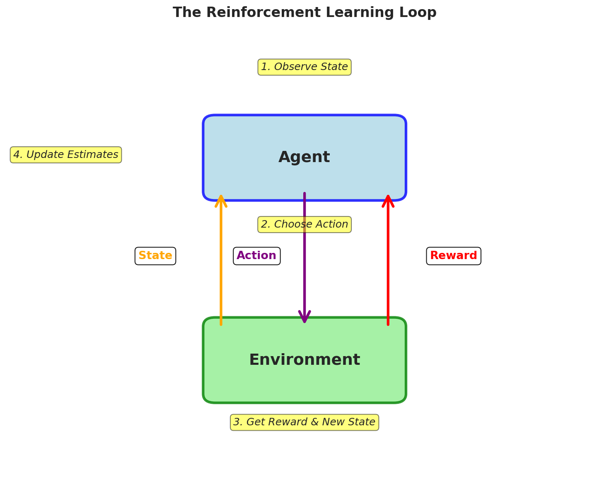
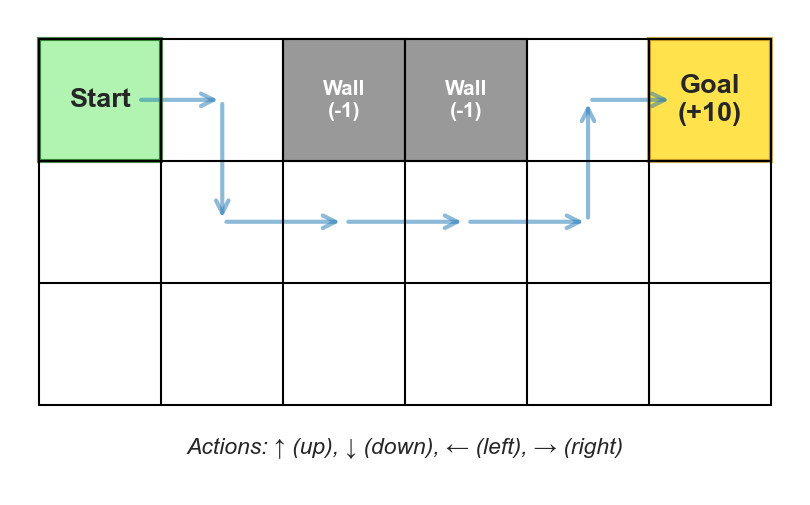
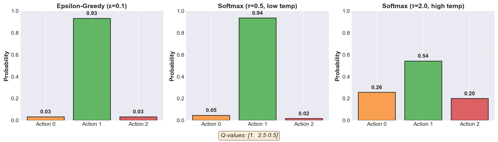

# Reinforcement Learning Workshop

**Workshop Goals:**
- Understand the RL problem and core concepts
- Build intuition for when and how to use RL

---

## Part 1: What is Reinforcement Learning?

### The Core Idea

You're an agent (robot, game player, algorithm) making decisions over time. You:

1. **Observe** where you are (the "state")
2. **Choose** what to do (an "action")
3. **Get feedback** (a "reward")
4. **Move** to a new statew
5. **Repeat** and learn from experience

**Goal:** Learn which actions maximize total reward over time.



### Example: GridWorld Navigation

- **States**: Your position on a grid (e.g., row 2, column 3)
- **Actions**: Move up, down, left, or right
- **Rewards**: +10 for reaching goal, -1 for hitting wall, 0 otherwise
- **Challenge**: Figure out the best path from any position to the goal



**The key challenge:** You don't know which actions are good until you try them!

---

### Three Key Concepts

#### 1. State-Value Function: $V(s)$
Expected total reward starting from state $s$. Answers: *"How good is this state?"*

Example: $V(\text{next to goal})$ = high, $V(\text{far from goal})$ = low

#### 2. Action-Value Function: $Q(s, a)$
Expected total reward from state $s$, taking action $a$, then continuing optimally. Answers: *"How good is this action?"*

Example: $Q(\text{position}, \text{move toward goal})$ = high, $Q(\text{position}, \text{move into wall})$ = low

**Why Q is useful:** Pick the action with highest Q-value!

#### 3. Policy: $\pi(a|s)$
Your strategy for choosing actions. Answers: *"What should I do?"*

- **Deterministic:** Always pick the same action (e.g., "always move toward goal")
- **Stochastic:** Pick actions with some randomness (e.g., "70% left, 30% right")

**Key equation:** $V(s) = \sum_a \pi(a|s) \cdot Q(s, a)$

---

## Why Use Reinforcement Learning?

**RL is uniquely suited for:**
1. Sequential decision-making with long-term consequences
2. No labeled data - you can't get examples of "correct" actions
3. Trial and error is possible
4. Clear reward signal

**Real-world applications:** Game playing (AlphaGo, Chess), robotics, recommendation systems, resource management, trading

**When NOT to use RL:** You have labeled data, no sequential decisions, unsafe to explore, unclear rewards

---

### Connecting to Supervised Learning

You've trained neural networks with labeled data, loss functions, backprop, and optimizers (Adam, SGD).

**How RL differs:**

| Aspect | Supervised Learning | Reinforcement Learning |
|--------|---------------------|------------------------|
| **Signal** | Labels: "this IS correct" | Rewards: "that WAS good" |
| **Learns** | Input → Output | State → Action strategy |
| **Feedback** | Immediate | Delayed |
| **Goal** | Minimize loss | Maximize reward |

**Key insight:** Like gradient descent optimizes loss, RL optimizes rewards—but without knowing "correct" actions beforehand!

**You'll use:** NumPy (Q-tables are arrays), PyTorch (for Deep RL later), training loops, optimization thinking

---

## Part 2: Exploration vs. Exploitation

**The problem:** You don't know which actions are good until you try them!

- **Exploitation**: Use current knowledge (order your favorite dish)
- **Exploration**: Try new things (try a new dish)

Balance both or you either miss better options or never use what you learned!

---

### Strategy 1: Greedy (Pure Exploitation)

Always pick action with highest Q: $\pi(s) = \arg\max_a Q(s, a)$

**Pros:** Simple
**Cons:** Never explores, might miss better actions

---

### Strategy 2: Epsilon-Greedy

With probability $\epsilon$, choose randomly; otherwise be greedy.

```python
if random() < epsilon:
    action = random_action()        # Explore
else:
    action = argmax(Q[state])       # Exploit
```

**Common values:** $\epsilon = 0.1$ (10% exploration)

---

### Strategy 3: Softmax

Better actions more likely, but all have some chance:

$$\pi(a|s) = \frac{e^{Q(s,a)/\tau}}{\sum_{a'} e^{Q(s,a')/\tau}}$$

**Temperature $\tau$:** High = more exploration, Low = more exploitation

```python
def softmax_policy(Q_values, temperature=1.0):
    exp_Q = np.exp(Q_values / temperature)
    return np.random.choice(len(Q_values), p=exp_Q/np.sum(exp_Q))
```



---

## Part 3: Multi-Armed Bandits

**Simplest RL case:** One state, multiple actions (like slot machines). Goal: find best action through trial and error.

### Learning Q-values

Average the rewards: $Q_n(a) = \frac{r_1 + r_2 + ... + r_n}{n}$

**Incremental update** (the universal RL pattern):
$$Q_{n+1}(a) = Q_n(a) + \alpha [r_{n+1} - Q_n(a)]$$

```
NewEstimate = OldEstimate + StepSize × [Reward - OldEstimate]
```

- Use $\alpha = \frac{1}{n}$ (simple averaging) when values don't change
- Use constant $\alpha = 0.1$ (exponential) when values change over time

### Algorithm

```
Initialize: Q[a] = 0 for all actions

For each step:
  if random() < epsilon:
    action = random_action()
  else:
    action = argmax(Q)

  reward = environment.step(action)
  Q[action] += alpha * (reward - Q[action])
```

---

## Part 4: Introduction to Q-Learning

**Beyond bandits:** Now actions move you between states and affect future rewards!

### Discounted Return

Discount future rewards using $\gamma$ (gamma):

$$G_t = r_t + \gamma r_{t+1} + \gamma^2 r_{t+2} + ...$$

- $\gamma = 0$: Only immediate reward (myopic)
- $\gamma = 0.99$: Common value - cares about future but discounts
- $\gamma = 1$: All rewards equally important

### Q-Learning Update Rule

$$Q(s_t, a_t) \leftarrow Q(s_t, a_t) + \alpha [r_t + \gamma \max_a Q(s_{t+1}, a) - Q(s_t, a_t)]$$

**Breaking it down:**
- $r_t + \gamma \max_a Q(s_{t+1}, a)$ = Target (immediate reward + best future value)
- $\alpha$ = Learning rate

**Same pattern:** `NewEstimate = OldEstimate + α × [Target - OldEstimate]`

---

### Pseudocode: Q-Learning

```
Initialize:
  Q[s, a] = 0 for all state-action pairs

For each episode:
  state = env.reset()

  While not done:
    # Choose action using epsilon-greedy
    action = epsilon_greedy(Q[state])

    # Take action, observe result
    next_state, reward, done = env.step(action)

    # Q-Learning update (uses max!)
    if done:
        target = reward
    else:
        target = reward + gamma * max(Q[next_state])

    Q[state, action] += alpha * (target - Q[state, action])

    state = next_state
```

**Key point:** Uses $\max$ Q-value in next state, regardless of which action we take ("off-policy")

---

### Demo: Q-Learning on FrozenLake

**Gymnasium** provides RL environments (like a library of games for training agents).

**FrozenLake:** 4×4 grid, navigate start → goal, avoid holes, slippery surface!

```python
import gymnasium as gym
import numpy as np

def train_q_learning(env_name='FrozenLake-v1', episodes=5000,
                     alpha=0.1, gamma=0.99, epsilon=0.1):
    env = gym.make(env_name)
    Q = np.zeros([env.observation_space.n, env.action_space.n])
    wins = []

    for episode in range(episodes):
        state, _ = env.reset()
        done = False

        while not done:
            # Epsilon-greedy
            if np.random.random() < epsilon:
                action = env.action_space.sample()
            else:
                action = np.argmax(Q[state])

            next_state, reward, terminated, truncated, _ = env.step(action)
            done = terminated or truncated

            # Q-Learning update
            target = reward if done else reward + gamma * np.max(Q[next_state])
            Q[state, action] += alpha * (target - Q[state, action])
            state = next_state

        wins.append(reward)

    return Q, wins

# Train the agent
Q, wins = train_q_learning()

# Test performance
print(f"Win rate (last 100 episodes): {np.mean(wins[-100:]):.2%}")
```

**Install required library:**
```bash
pip install gymnasium
```

---

### Why Q-Learning Works

**Bootstrapping:** Use estimates to update estimates (current estimate of future → update current value)

**Advantages:** Learn from every step, learns optimal policy while exploring, simple

**Works well for:** Discrete states/actions, not too many state-action pairs

---

## Next Steps

**Practice environments:** FrozenLake, Taxi-v3, CliffWalking, CartPole

**Beyond tabular RL:** Deep Q-Learning (DQN) uses neural networks for large state spaces

**Key takeaway:** The update pattern you learned today (`NewEstimate = OldEstimate + α × [Target - OldEstimate]`) appears in ALL RL algorithms!
