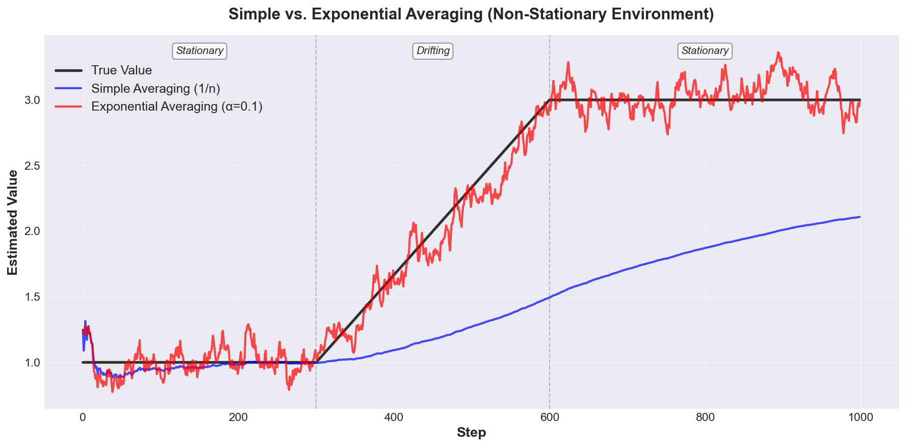
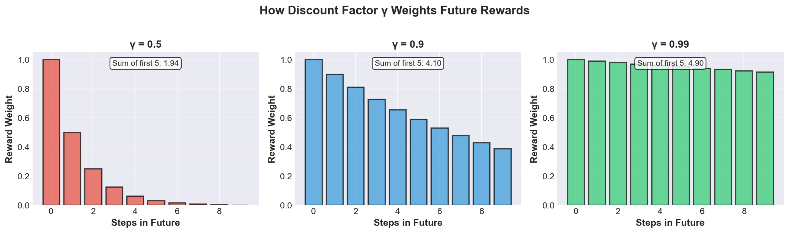

# Reinforcement Learning Workshop

A hands-on introduction to core RL concepts for first-year university students.

**Workshop Goals:**
- Understand the RL problem and core concepts
- Implement a working RL algorithm from scratch
- Build intuition for when and how to use RL

---

## Part 1: What is Reinforcement Learning?

### The Core Idea

You're an agent (robot, game player, algorithm) making decisions over time. You:

1. **Observe** where you are (the "state")
2. **Choose** what to do (an "action")
3. **Get feedback** (a "reward")
4. **Move** to a new state
5. **Repeat** and learn from experience

**Goal:** Learn which actions maximize total reward over time.


### Example: GridWorld Navigation

- **States**: Your position on a grid (e.g., row 2, column 3)
- **Actions**: Move up, down, left, or right
- **Rewards**: +10 for reaching goal, -1 for hitting wall, 0 otherwise
- **Challenge**: Figure out the best path from any position to the goal


**The key challenge:** You don't know which actions are good until you try them!

---

### Three Key Concepts

#### 1. State-Value Function: $V(s)$

**What it means:** Expected total reward starting from state $s$

**Answers:** "How good is it to be in this state?"

**Example:**
- $V(\text{next to goal})$ = high
- $V(\text{far from goal})$ = low

---

#### 2. Action-Value Function: $Q(s, a)$

**What it means:** Expected total reward from state $s$, taking action $a$, then continuing optimally

**Answers:** "How good is it to take this action right now?"

**Example:**
- $Q(\text{position}, \text{move toward goal})$ = high
- $Q(\text{position}, \text{move into wall})$ = low

**Why Q is useful:** If you know $Q(s, a)$ for all actions, you can directly pick the best action by choosing the one with the highest $Q$ value!

---

#### 3. Policy: $\pi(a|s)$

**What it means:** Your strategy - tells you which action to take in each state

**Answers:** "What should I do in this state?"

**Two types:**
- **Deterministic:** Always pick the same action in a state
  - Example: "Always move toward the goal"
- **Stochastic:** Pick actions with some randomness
  - Example: "70% left, 30% right"

**Key equation:**
$$V(s) = \sum_a \pi(a|s) \cdot Q(s, a)$$

The value of a state is the weighted average of action-values based on how likely you are to take each action.

---

### Quick Check
- What's the difference between $V(s)$ and $Q(s, a)$?
- Why is $Q$ more directly useful for choosing actions?
- If $\pi(\text{up}|s) = 1.0$, what does this mean?

---

## Part 2: Exploration vs. Exploitation

**The Central Problem:** You don't know which actions are good until you try them!

**Two competing goals:**
- **Exploitation**: Use current knowledge to get best reward now
- **Exploration**: Try new things to potentially discover something better

**Real-world analogy:**
- Exploitation: Order your favorite restaurant dish
- Exploration: Try a new dish you've never had

If you always exploit, you might miss better options. If you always explore, you never use what you learned!

---

### Strategy 1: Greedy Policy (Pure Exploitation)

**The rule:** Always pick the action with highest $Q$ value

$$\pi(s) = \arg\max_a Q(s, a)$$

($\arg\max_a$ means "whichever action $a$ gives the biggest...")

**Example:** If Q-values are [2.0, 5.1, 3.2], always pick action 1 (the middle one with value 5.1)

**Pros:** Simple, uses your knowledge
**Cons:** Never explores - might miss better actions!

---

### Strategy 2: Epsilon-Greedy (Simple Exploration)

**The rule:** With probability $\epsilon$, choose randomly; otherwise be greedy

```python
if random() < epsilon:
    action = random_action()        # Explore!
else:
    action = argmax(Q[state])       # Exploit!
```

**Example:** With $\epsilon = 0.1$ (10% exploration):
- 90% of the time: pick best known action
- 10% of the time: pick any action randomly

**Common values:** $\epsilon = 0.1$ or $\epsilon = 0.05$

---

### Strategy 3: Softmax Policy (Probability-Based)

**The rule:** Better actions are more likely, but all actions have some chance

$$\pi(a|s) = \frac{e^{Q(s,a)/\tau}}{\sum_{a'} e^{Q(s,a')/\tau}}$$

**Temperature parameter $\tau$:**
- High $\tau$ → more random (more exploration)
- Low $\tau$ → more focused on best action (more exploitation)

**Python example:**
```python
def softmax_policy(Q_values, temperature=1.0):
    exp_Q = np.exp(Q_values / temperature)
    probs = exp_Q / np.sum(exp_Q)
    return np.random.choice(len(Q_values), p=probs)
```

**Example:** With Q = [1.0, 2.5, 0.5] and $\tau = 1.0$:
- Action 0: ~24% probability
- Action 1: ~67% probability (highest Q!)
- Action 2: ~9% probability


---

### Quick Check
- If $\epsilon = 0$, what happens? What if $\epsilon = 1$?
- Why is softmax better than epsilon-greedy for actions with very different Q-values?

---

## Part 3: Multi-Armed Bandits

### The Problem

**Simplest RL case:** One state, multiple actions (like choosing between slot machines)

**Goal:** Learn which action gives best average reward

**No states to navigate** - just find the best action through trial and error

---

### Learning Q-values: Simple Averaging

After taking action $a$ and getting rewards $r_1, r_2, ..., r_n$:

$$Q_n(a) = \frac{r_1 + r_2 + ... + r_n}{n}$$

Just the average reward!

**Incremental form** (update after each try):
$$Q_{n+1}(a) = Q_n(a) + \frac{1}{n}[r_{n+1} - Q_n(a)]$$

**The universal pattern:**
```
NewEstimate = OldEstimate + StepSize × [Reward - OldEstimate]
```

**Example:**
- Tried action 3 times, got [1, 3, 2], so $Q_3 = 2$
- Try again, get reward 4
- Update: $Q_4 = 2 + \frac{1}{4}[4 - 2] = 2.5$

---

### Better for Changing Environments: Exponential Averaging

**Problem with simple averaging:** Old experiences matter as much as recent ones

**Solution:** Use constant step-size $\alpha$:

$$Q_{n+1}(a) = Q_n(a) + \alpha [r_{n+1} - Q_n(a)]$$

**Common values:** $\alpha = 0.1$ (slow learning) or $\alpha = 0.5$ (fast learning)

**When to use each:**
- Simple averaging ($\frac{1}{n}$): When true values don't change
- Exponential ($\alpha$): When true values might change over time



---

### Pseudocode: Epsilon-Greedy Bandit

```
Initialize:
  Q[a] = 0 for all actions

For each step:
  # Epsilon-greedy action selection
  if random() < epsilon:
    action = random_action()
  else:
    action = argmax(Q)

  # Take action and observe reward
  reward = environment.step(action)

  # Update Q-value (exponential averaging)
  Q[action] = Q[action] + alpha * (reward - Q[action])
```

---

### Hands-On Exercise

**Implement epsilon-greedy bandit from scratch!**

```python
import numpy as np
import matplotlib.pyplot as plt

class SimpleBandit:
    """A k-armed bandit environment"""
    def __init__(self, k=10):
        self.k = k
        # True action values (hidden from agent)
        self.true_values = np.random.randn(k)

    def step(self, action):
        # Return noisy reward around true value
        return np.random.randn() + self.true_values[action]

def epsilon_greedy_bandit(env, n_steps=1000, epsilon=0.1, alpha=0.1):
    Q = np.zeros(env.k)  # Q-value estimates
    rewards = []

    for _ in range(n_steps):
        # TODO: Implement epsilon-greedy action selection
        #   Hint: if np.random.random() < epsilon: ...

        # TODO: Get reward from environment
        #   Hint: reward = env.step(action)

        # TODO: Update Q-value
        #   Hint: Q[action] += alpha * (reward - Q[action])

        # TODO: Track reward
        #   Hint: rewards.append(reward)
        pass

    return rewards, Q

# Run experiment
env = SimpleBandit(k=10)
rewards, final_Q = epsilon_greedy_bandit(env, epsilon=0.1)

# Plot results
plt.plot(np.cumsum(rewards) / (np.arange(len(rewards)) + 1))
plt.xlabel('Steps')
plt.ylabel('Average Reward')
plt.title('Epsilon-Greedy Bandit Performance')
plt.show()
```

**Challenges to try:**
1. Implement the epsilon-greedy algorithm
2. Compare $\epsilon = 0$ vs $\epsilon = 0.1$ vs $\epsilon = 0.3$
3. Compare simple averaging vs. exponential averaging
4. Try a non-stationary bandit (true values change over time)

---

## Part 4: Introduction to Q-Learning

### Moving to Sequential Decisions

**Bandit limitation:** Only one state, actions have no long-term consequences

**Real RL:** Actions move you between states and affect future rewards

**Key new concept:** Discount future rewards

---

### The Discounted Return

**Question:** Should we value rewards 1 step away the same as 100 steps away?

**Answer:** Discount future rewards using $\gamma$ (gamma):

$$G_t = r_t + \gamma r_{t+1} + \gamma^2 r_{t+2} + ...$$

**What $\gamma$ does:**
- $\gamma = 0$: Only care about immediate reward (shortsighted)
- $\gamma = 0.9$: Reward 10 steps away is worth $0.9^{10} \approx 0.35$ times as much
- $\gamma = 0.99$: Common value - cares about future but still discounts
- $\gamma = 1$: All rewards equally important

**Example:** Rewards [1, 2, 3] with $\gamma = 0.9$:
$$G = 1 + 0.9(2) + 0.81(3) = 1 + 1.8 + 2.43 = 5.23$$



---

### Q-Learning: The Algorithm

**Goal:** Learn $Q(s, a)$ values for multi-state environments

**The update rule:**
$$Q(s_t, a_t) \leftarrow Q(s_t, a_t) + \alpha [r_t + \gamma \max_a Q(s_{t+1}, a) - Q(s_t, a_t)]$$

**Breaking it down:**
- $Q(s_t, a_t)$: Q-value for action you just took
- $r_t$: Immediate reward
- $\gamma \max_a Q(s_{t+1}, a)$: Best estimated future value (discounted)
- $[r_t + \gamma \max_a Q(s_{t+1}, a)]$: **Target** (improved estimate)
- $\alpha$: Learning rate

**Same pattern as before:**
```
NewEstimate = OldEstimate + α × [Target - OldEstimate]
```

---

### Pseudocode: Q-Learning

```
Initialize:
  Q[s, a] = 0 for all state-action pairs

For each episode:
  state = env.reset()

  While not done:
    # Choose action using epsilon-greedy
    action = epsilon_greedy(Q[state])

    # Take action, observe result
    next_state, reward, done = env.step(action)

    # Q-Learning update (uses max!)
    if done:
        target = reward
    else:
        target = reward + gamma * max(Q[next_state])

    Q[state, action] += alpha * (target - Q[state, action])

    state = next_state
```

**Key point:** We use $\max$ Q-value in next state, regardless of which action we actually take (this is "off-policy" learning)

---

### Quick Demo: Q-Learning on FrozenLake

```python
import gymnasium as gym
import numpy as np

def train_q_learning(env_name='FrozenLake-v1', episodes=5000,
                     alpha=0.1, gamma=0.99, epsilon=0.1):
    env = gym.make(env_name)
    Q = np.zeros([env.observation_space.n, env.action_space.n])

    wins = []

    for episode in range(episodes):
        state, _ = env.reset()
        done = False

        while not done:
            # Epsilon-greedy
            if np.random.random() < epsilon:
                action = env.action_space.sample()
            else:
                action = np.argmax(Q[state])

            # Take action
            next_state, reward, terminated, truncated, _ = env.step(action)
            done = terminated or truncated

            # Q-Learning update
            if done:
                target = reward
            else:
                target = reward + gamma * np.max(Q[next_state])

            Q[state, action] += alpha * (target - Q[state, action])
            state = next_state

        wins.append(reward)

    return Q, wins

# Train the agent
Q, wins = train_q_learning()

# Test performance
print(f"Win rate (last 100 episodes): {np.mean(wins[-100:]):.2%}")
```

**Install required library:**
```bash
pip install gymnasium
```

---

### Why Q-Learning Works

**Key insight:** We use our current estimate of future value to update our estimate of current value

This is called **bootstrapping** - using estimates to update estimates

**Advantages:**
- Learn from every step (don't wait for episode to end)
- Learns optimal policy even while exploring
- Simple and effective

**When it works well:**
- Discrete states and actions
- Not too many state-action pairs
- Can visit states multiple times

---

## Wrap-Up & Next Steps

### What You Learned Today

- RL fundamentals: states, actions, rewards
- Value functions ($V$ and $Q$) and policies ($\pi$)
- Exploration vs. exploitation strategies
- Implemented multi-armed bandit from scratch
- Q-Learning update rule and algorithm
- Ran your first RL algorithm on a real environment

---

### The Universal Pattern

Nearly every RL algorithm follows this:

$$\text{New} = \text{Old} + \alpha [\text{Target} - \text{Old}]$$

**What differs:**
- What we estimate (V, Q, or policy)
- How we compute the target
- How we represent estimates (tables, neural networks, etc.)

---

### Practice Problems

1. **Multi-Armed Bandit Challenge**:
   - Implement softmax policy instead of epsilon-greedy
   - Create a non-stationary bandit (true values drift)
   - Compare different $\alpha$ and $\epsilon$ values

2. **Q-Learning Practice**:
   - Run Q-Learning on `Taxi-v3` or `CliffWalking-v0`
   - Visualize learned Q-values as a heatmap
   - Try different $\gamma$ values - how does it affect behavior?

3. **Parameter Tuning**:
   - How does $\alpha$ affect convergence speed?
   - What happens with $\gamma = 0.9$ vs $\gamma = 0.99$?
   - Find the best $\epsilon$ for fastest learning

---

### Recommended Next Steps

**Easy environments to try:**
- `FrozenLake-v1`: Slippery gridworld
- `Taxi-v3`: Pick up and drop off passengers
- `CliffWalking-v0`: Navigate around a cliff

**Install:**
```bash
pip install gymnasium
pip install matplotlib numpy
```

**Resources for going deeper:**
- **Sutton & Barto** - "Reinforcement Learning: An Introduction" (free online)
- **Spinning Up in Deep RL** - OpenAI's tutorial with code
- **Stable-Baselines3** - State-of-the-art RL implementations

---

### Beyond Tabular RL

**What we covered:** Tabular methods (Q-tables)

**What's next:**
- **Function approximation:** Handle continuous states, large state spaces
- **Deep RL:** Use neural networks (DQN, PPO, SAC)
- **Policy gradient methods:** Learn policy directly
- **Advanced topics:** Multi-agent RL, model-based RL, meta-RL

**The good news:** The fundamentals you learned today apply to ALL modern RL algorithms!

---

### Final Check

Can you answer these?

- What's the difference between exploration and exploitation?
- What does the discount factor $\gamma$ control?
- Why do we use $\max$ in the Q-Learning update?
- When would you use Q-Learning vs. a simple bandit approach?

**If yes, you understand the fundamentals!**

---

## Quick Reference

### Key Equations

**Q-value update (Q-Learning):**
$$Q(s, a) \leftarrow Q(s, a) + \alpha [r + \gamma \max_{a'} Q(s', a') - Q(s, a)]$$

**Epsilon-greedy:**
```python
action = random_action() if random() < ε else argmax(Q[state])
```

**Discounted return:**
$$G_t = r_t + \gamma r_{t+1} + \gamma^2 r_{t+2} + ...$$

### Common Hyperparameters

| Parameter | Typical Values | What it controls |
|-----------|---------------|------------------|
| $\alpha$ (learning rate) | 0.01 - 0.5 | How fast we learn |
| $\gamma$ (discount) | 0.9 - 0.99 | How much we value future |
| $\epsilon$ (exploration) | 0.05 - 0.2 | How much we explore |

### Debugging Tips

**Q-values not improving?**
- Learning rate too low → increase $\alpha$
- Not exploring enough → increase $\epsilon$
- Not enough episodes → train longer

**Learning unstable?**
- Learning rate too high → decrease $\alpha$
- Discount factor too high → try $\gamma = 0.9$ instead of 0.99

**Agent not reaching goal?**
- Sparse rewards → try reward shaping
- Environment too hard → try simpler environment first
- $\gamma$ too low → increase to value future rewards

---

**Workshop complete!** Now go implement something cool!
