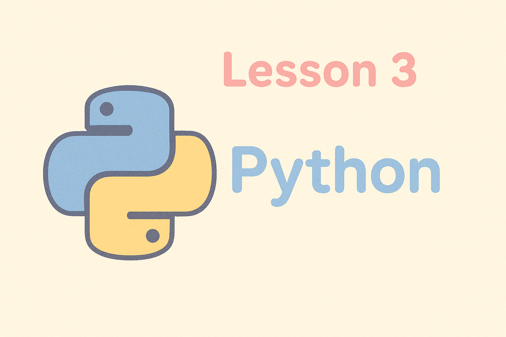

# Python Development Environment Setup

_Let's setup the tools we need to access python_

## Overview
Before we dive into Python programming in Workshop 3, let's set up a professional development environment. We'll install VS Code (a powerful code editor) and some helpful extensions that will make your coding experience much smoother.

**Don't worry if this feels like a lot of setup** - once it's done, you'll have a development environment that professional programmers use every day! 🐍

## What We'll Install

- **VS Code**: A powerful, free code editor with lots of helpful features
- **VS Code Extensions**: Add-ons that make coding easier and more enjoyable

## Setup for Different Operating Systems

### Windows with WSL2/Ubuntu

We're assuming you followed Workshop 1 and have WSL2 with Ubuntu/Python set up.

#### Install VS Code
Here's a [video guide](https://www.youtube.com/watch?v=SyAlaukOOrQ).
1. Download VS Code from [code.visualstudio.com](https://code.visualstudio.com/)
2. Install it on Windows (not inside WSL)
3. Install the ["WSL" extension](https://marketplace.visualstudio.com/items?itemName=ms-vscode-remote.remote-wsl) in VS Code
4. You can then open WSL folders directly from VS Code!

### macOS

#### Install VS Code
1. Download VS Code from [code.visualstudio.com](https://code.visualstudio.com/)
2. Drag the downloaded app to your Applications folder
3. Open VS Code from Applications or Spotlight search

### Alternative: Using Replit (No Installation Required)

If you prefer not to install VSCode or want to get started immediately, **Replit** is an online development environment that runs in your browser:

### Setting Up Python in Replit:

1. **Create a Replit account:**
   - Go to [replit.com](https://replit.com)
   - Sign up with your email or GitHub account

2. **Create a new Python project:**
   - Click "Create Repl"
   - Choose "Python" as the template
   - Give your project a name like "zero-to-ml-practice"
   - Click "Create Repl"

3. **Understanding the Replit interface:**
   - **Left panel**: File explorer (like VS Code's sidebar)
   - **Center panel**: Code editor
   - **Right panel**: Console/terminal
   - **Top**: Run button to execute your code

4. **Test your setup:**
   - In the main.py file, write: `print("Hello from Replit!")`
   - Click the green "Run" button
   - You should see the output in the console

5. **Install packages in Replit:**
   - Replit automatically detects when you import packages
   - Or use the terminal (right panel): `pip install package-name`
   - Or use the "Packages" tab in the left sidebar for a visual interface

**Replit Advantages:**
- No installation required
- Works on any device with a browser
- Automatic saving and backup
- Easy sharing and collaboration
- Built-in terminal and package management

**Replit Limitations:**
- Requires internet connection
- Limited number of projects unless you pay
- Can't use extensions that professionals would

## Essential VS Code Extensions

Once you have VS Code installed, these extensions will supercharge your Python development:

### Core Python Extensions:

1. **Python** (by Microsoft)
   - Install: Search "Python" in VS Code extensions (on the top left sidebar)
   - What it does: Syntax highlighting, debugging, code formatting, and more
   - Essential for any Python development!

2. **Pylance** (by Microsoft)
   - Usually installs automatically with the Python extension
   - What it does: Advanced code analysis, auto-completion, and error detection
   - Think of it as a smart assistant that helps catch mistakes

### Installing Extensions:
```bash
# Open VS Code
code

# Then use Ctrl+Shift+X to open extensions panel
# Or click the Extensions icon in the left sidebar
# Search for extension names and click "Install"
```

## Bonus: GitHub Copilot for Students 🤖

**GitHub Copilot** is an AI assistant that helps you write code by suggesting completions and entire functions. It's incredibly helpful for learning and productivity!

### Getting Copilot for Free:

1. **Sign up for GitHub Education:**
   - Go to [education.github.com](https://education.github.com)
   - Click "Get benefits"
   - Verify your student status (usually with your student email and student ID)

2. **Apply for GitHub Student Developer Pack:**
   - Includes free GitHub Copilot
   - Plus many other developer tools and credits

3. **Install GitHub Copilot in VS Code:**
   - Search for "GitHub Copilot" in VS Code extensions
   - Install and sign in with your GitHub account
   - Follow the setup instructions

**Note:** Copilot is amazing but **not required** for our workshops. All exercises are designed to work without it. Think of it as a helpful tutor that can suggest code, but you should still understand what the code does!

## Testing Your Setup

Let's verify everything is working correctly:

### Test VS Code with Python:
1. Open VS Code: `code` (in terminal) or from applications
2. Create a new file: `Ctrl+N`
3. Save it as `test.py`: `Ctrl+S`
4. Write some Python code:
   ```python
   print("Hello from VS Code!")
   ```
5. Run the code by running `python3 test.py` in the terminal.

## Troubleshooting Common Issues

### VS Code Won't Open
- **Linux/WSL**: Make sure you installed it correctly or use the Windows version with WSL extension
- **macOS**: Make sure VS Code is in your Applications folder
- Try opening from the command line: `code`

### VS Code Extensions Not Working
- Make sure you have the Python extension installed
- Check that VS Code is using the right Python interpreter (bottom left of VS Code status bar)
- Try reloading VS Code: `Ctrl+Shift+P` then type "Developer: Reload Window"

## Alternative Editors (If You Prefer)

While we recommend VS Code for this workshop series, here are other excellent options:

- **PyCharm Community Edition**: More heavyweight but very powerful for Python
- **Sublime Text**: Lightweight and fast
- **Atom**: Customizable (though GitHub is discontinuing it)
- **Vim/Neovim**: For the adventurous (very steep learning curve)
- **nano**: The simple editor we learned in Workshop 1 (perfectly fine for small scripts, but you won't have VSCode extensions that professionals use)

## What's Next?

Once you have everything installed, you're ready for **Workshop 3: Object-Oriented Programming with Python**! We'll use all these tools to write real Python programs and start building the foundation for machine learning.

### Quick Setup Checklist:
- [ ] Python 3.8+ installed and working
- [ ] pip working and can install packages
- [ ] VS Code installed and can run Python files
- [ ] Python extension installed in VS Code
- [ ] (Optional) GitHub Copilot set up through GitHub Education

### Pro Tips for Your New Setup:
- **Learn VS Code keyboard shortcuts** - they'll save you tons of time
- **Explore the VS Code command palette** (`Ctrl+Shift+P`) - it can do almost anything
- **Use the integrated terminal** in VS Code (`Ctrl+` `) instead of switching between windows

Remember: **A good development environment makes coding much more enjoyable!** Take time to customize VS Code with themes and extensions that make you happy. When you enjoy the tools you use, learning becomes more fun! 💪

---

*Ready to code? Head to Workshop 3: Object-Oriented Programming with Python!* 🚀

To switch to the third workshop, run:
```bash
git checkout workshop-3
```
and then open `README.md`.