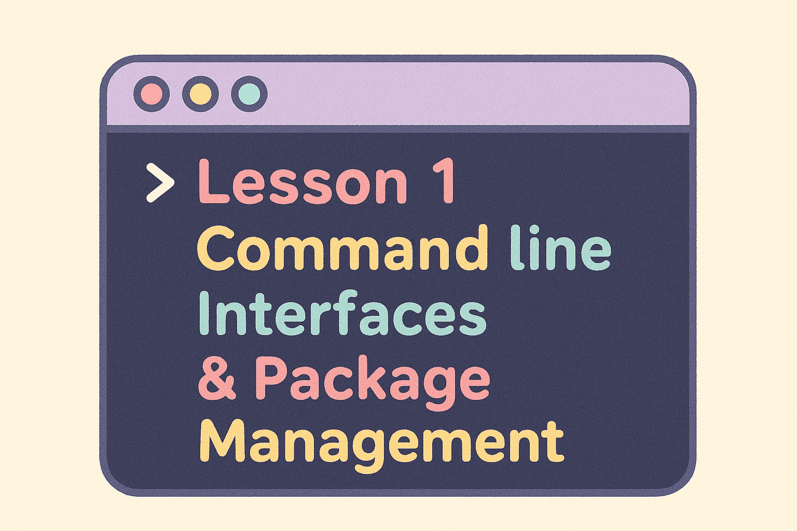

# Pause: Python Development Environment Setup

_Let's set up Python and its essential tools_

## Overview

Before we explore package management, let's set up the tools we need for python package management.

What We'll Install:
- **Python**: The programming language itself
- **pip**: Python's package manager (for installing libraries)
- **venv**: Tool for creating isolated Python environments

## Setup for Different Operating Systems

### Windows with WSL2/Ubuntu

If you followed Workshop 1 and have WSL2 with Ubuntu set up, here's how to install everything:

#### Install Python
```bash
# Update your package list first
sudo apt update

# Install Python 3, pip, and venv
sudo apt install python3 python3-pip python3-venv

# Verify installation
python3 --version
pip3 --version
```

### macOS

#### Install Python
```bash
# Install Python using Homebrew (from Workshop 1)
brew install python

# Verify installation
python3 --version
pip3 --version
```

**Note:** macOS comes with Python pre-installed, but it's often an older version. Using Homebrew ensures you get the latest version.

### Alternative: Using Replit (No Installation Required)

If you prefer not to install anything locally or want to get started immediately, **Replit** is an online development environment that runs in your browser:

1. Go to [replit.com](https://replit.com) and sign up for an account.
2. Create a new Python project (Repl) and start coding right away.
3. You can install packages using `pip install package-name` in the Replit terminal.

Replit is a great way to practice Python without any installation, but you'll eventually want to set up Python locally for more control and features.

## Testing Your Setup
Let's verify everything is working correctly:

### Test Python Installation:
```bash
# Check Python version (should be 3.8 or higher)
python3 --version

# Check pip
pip3 --version

# Test Python interactively
python3 -c "print('Python is ready!')"
```

## Troubleshooting Common Issues
### Python Command Not Found
- **Linux/WSL**: Try `sudo apt install python3`
- **macOS**: Try `brew install python3`
- Make sure you're using `python3` if `python` does not work.

### Permission Errors with pip
- We'll teach you how to use pip with virtual environments soon.
- Don't use `sudo` with pip.